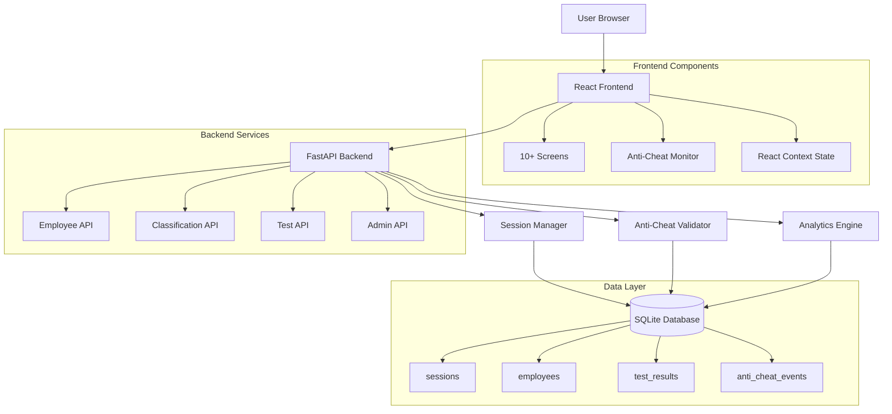
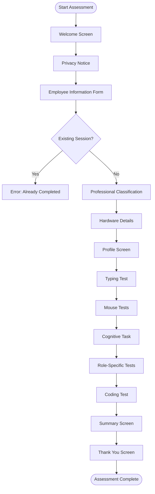
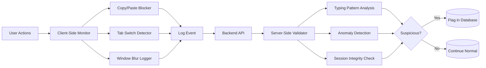

# Employee Assessment System - Technical Architecture

**Version:** 2.0.0  
**Date:** February 28, 2026  
**Status:** Architecture Design Phase

---

## Executive Summary

This document outlines the comprehensive technical architecture for implementing the missing 75% of the Employee Assessment System. The current system (25% complete) has sophisticated typing/cognitive analytics but lacks core employee assessment features. This architecture bridges that gap by adding employee demographics, professional classification, hardware profiling, mouse behavior analysis, role-specific testing (24 tests), anti-cheating mechanisms, and persistent data storage.

**Current State:** Typing test, coding test, cognitive task, advanced analytics  
**Target State:** Complete employee assessment platform with 10+ screens, 24 role-specific tests, anti-cheating, and data persistence

---

## Table of Contents

1. [System Architecture Overview](#1-system-architecture-overview)
2. [Data Models & Schema](#2-data-models--schema)
3. [Frontend Architecture](#3-frontend-architecture)
4. [Backend Architecture](#4-backend-architecture)
5. [Role-Specific Test Library Design](#5-role-specific-test-library-design)
6. [Anti-Cheating Mechanisms](#6-anti-cheating-mechanisms)
7. [Data Collection & Storage](#7-data-collection--storage)
8. [Implementation Phases](#8-implementation-phases)
9. [Integration Strategy](#9-integration-strategy)
10. [Technical Decisions](#10-technical-decisions)

---

## 1. System Architecture Overview

### 1.1 Updated Application Flow

```
┌─────────────────────────────────────────────────────────────────┐
│                    EMPLOYEE ASSESSMENT FLOW                      │
└─────────────────────────────────────────────────────────────────┘

1. Welcome Screen
   ↓
2. Privacy Notice
   ↓
3. Employee Information Form (NEW)
   ├─ Name, Email, Employee ID
   ├─ Department, Position, Experience
   ├─ Education, Age Range, Location
   └─ Session ID Generation
   ↓
4. Professional Classification (NEW)
   ├─ 8-10 Questions
   ├─ Auto-classify: Frontend/Backend/Research/Maintenance
   └─ Confidence Score Calculation
   ↓
5. Hardware Details Collection (NEW)
   ├─ Screen Resolution
   ├─ Browser/OS Detection
   ├─ Input Device Type
   └─ Network Latency Test
   ↓
6. Universal Tests (EXISTING + ENHANCED)
   ├─ Typing Test (existing)
   ├─ Mouse Click Accuracy Test (NEW)
   ├─ Mouse Reaction Time Test (NEW)
   ├─ Drag-Drop Precision Test (NEW)
   └─ Cognitive Variation Task (existing)
   ↓
7. Role-Specific Tests (NEW)
   ├─ Frontend: 6 tests
   ├─ Backend: 6 tests
   ├─ Research: 6 tests
   └─ Maintenance: 6 tests
   ↓
8. Coding Test (existing, enhanced)
   ↓
9. Summary & Thank You
   ├─ Visible: Basic completion message
   └─ Hidden: Complete analytics stored
   ↓
10. Admin Access (NEW)
    └─ Export complete session data (JSON)
```

### 1.2 Data Flow Diagram

```
┌──────────────┐
│   Browser    │
│  (Frontend)  │
└──────┬───────┘
       │
       │ HTTP/REST
       │
┌──────▼───────────────────────────────────────────────┐
│              FastAPI Backend                         │
│  ┌────────────────────────────────────────────────┐ │
│  │         Session Manager                        │ │
│  │  - Generate Session ID                         │ │
│  │  - Track Completion Status                     │ │
│  │  - Enforce One-Attempt Rule                    │ │
│  └────────────┬───────────────────────────────────┘ │
│               │                                       │
│  ┌────────────▼───────────────────────────────────┐ │
│  │         Data Processors                        │ │
│  │  - Employee Info Validator                     │ │
│  │  - Classification Engine                       │ │
│  │  - Mouse Metrics Analyzer                      │ │
│  │  - Role Test Evaluator                         │ │
│  │  - Anti-Cheat Validator                        │ │
│  └────────────┬───────────────────────────────────┘ │
│               │                                       │
│  ┌────────────▼───────────────────────────────────┐ │
│  │         Analytics Engine (existing)            │ │
│  │  - Typing Metrics Calculator                   │ │
│  │  - Cognitive Profile Analyzer                  │ │
│  │  - Behavioral Pattern Detector                 │ │
│  └────────────┬───────────────────────────────────┘ │
└───────────────┼───────────────────────────────────────┘
                │
                │
┌───────────────▼───────────────────────────────────────┐
│           Persistence Layer                           │
│  ┌──────────────────┐      ┌──────────────────────┐  │
│  │   SQLite DB      │  OR  │   JSON Files         │  │
│  │  - sessions.db   │      │  - sessions/         │  │
│  │  - employees.db  │      │  - employees/        │  │
│  │  - test_results  │      │  - test_results/     │  │
│  └──────────────────┘      └──────────────────────┘  │
└───────────────────────────────────────────────────────┘
```

### 1.3 Component Relationships

```
┌─────────────────────────────────────────────────────────────┐
│                      Frontend Layer                         │
│  ┌──────────────┐  ┌──────────────┐  ┌──────────────┐     │
│  │   Screens    │  │  Components  │  │    State     │     │
│  │  (10+ views) │◄─┤  (Reusable)  │◄─┤  Management  │     │
│  └──────┬───────┘  └──────────────┘  └──────────────┘     │
│         │                                                    │
│  ┌──────▼───────────────────────────────────────────────┐  │
│  │         Anti-Cheat Monitor (Client-Side)             │  │
│  │  - Copy/Paste Blocker                                │  │
│  │  - Tab Switch Detector                               │  │
│  │  - Window Blur Logger                                │  │
│  └──────────────────────────────────────────────────────┘  │
└─────────────────────────────────────────────────────────────┘
                            │
                            │ API Calls
                            │
┌─────────────────────────────────────────────────────────────┐
│                      Backend Layer                          │
│  ┌──────────────┐  ┌──────────────┐  ┌──────────────┐     │
│  │  API Routes  │  │  Validators  │  │   Analyzers  │     │
│  │  (REST)      │─►│  (Pydantic)  │─►│  (Business)  │     │
│  └──────────────┘  └──────────────┘  └──────┬───────┘     │
│                                              │              │
│  ┌──────────────────────────────────────────▼───────────┐  │
│  │         Anti-Cheat Validator (Server-Side)           │  │
│  │  - Typing Pattern Analysis                           │  │
│  │  - Timing Anomaly Detection                          │  │
│  │  - Session Integrity Check                           │  │
│  └──────────────────────────────────────────────────────┘  │
└─────────────────────────────────────────────────────────────┘
                            │
                            │ Persistence
                            │
┌─────────────────────────────────────────────────────────────┐
│                      Data Layer                             │
│  ┌──────────────┐  ┌──────────────┐  ┌──────────────┐     │
│  │   Employee   │  │   Sessions   │  │ Test Results │     │
│  │     Data     │  │     Data     │  │     Data     │     │
│  └──────────────┘  └──────────────┘  └──────────────┘     │
└─────────────────────────────────────────────────────────────┘
```

---

## 2. Data Models & Schema

### 2.1 Employee Demographic Model

```python
class EmployeeInfo(BaseModel):
    """Employee demographic and professional information"""
    # Identity
    employee_id: str = Field(..., min_length=3, max_length=50)
    full_name: str = Field(..., min_length=2, max_length=100)
    email: EmailStr
    
    # Professional
    department: str = Field(..., min_length=2, max_length=100)
    position: str = Field(..., min_length=2, max_length=100)
    years_experience: int = Field(ge=0, le=50)
    
    # Demographics
    education_level: str  # High School, Bachelor, Master, PhD
    age_range: str  # 18-25, 26-35, 36-45, 46-55, 56+
    location: str = Field(..., min_length=2, max_length=100)
    
    # Metadata
    session_id: str  # Auto-generated UUID
    timestamp: float  # Unix timestamp
    consent_given: bool = True
```

### 2.2 Professional Classification Model

```python
class ClassificationQuestion(BaseModel):
    """Single classification question"""
    question_id: str
    question_text: str
    answer: str
    weight: float  # For scoring

class ProfessionalClassification(BaseModel):
    """Professional role classification result"""
    session_id: str
    
    # Questions and answers
    questions: List[ClassificationQuestion]
    
    # Classification result
    primary_role: str  # Frontend, Backend, Research, Maintenance
    confidence_score: float = Field(ge=0.0, le=1.0)
    secondary_role: Optional[str] = None
    secondary_confidence: Optional[float] = None
    
    # Scoring breakdown
    frontend_score: float
    backend_score: float
    research_score: float
    maintenance_score: float
    
    # Metadata
    timestamp: float
    classification_method: str = "weighted_scoring"

# Classification Questions (8-10 questions)
CLASSIFICATION_QUESTIONS = [
    {
        "id": "q1",
        "text": "What percentage of your work involves visual design and user interfaces?",
        "options": ["0-25%", "25-50%", "50-75%", "75-100%"],
        "weights": {"Frontend": [0, 0.3, 0.7, 1.0], "Backend": [1.0, 0.7, 0.3, 0]}
    },
    {
        "id": "q2",
        "text": "How often do you work with databases and server-side logic?",
        "options": ["Rarely", "Sometimes", "Often", "Always"],
        "weights": {"Backend": [0, 0.3, 0.7, 1.0], "Frontend": [1.0, 0.7, 0.3, 0]}
    },
    {
        "id": "q3",
        "text": "Do you spend time analyzing data, running experiments, or building models?",
        "options": ["Never", "Occasionally", "Frequently", "Primarily"],
        "weights": {"Research": [0, 0.3, 0.7, 1.0]}
    },
    {
        "id": "q4",
        "text": "How much time do you spend fixing bugs vs building new features?",
        "options": ["Mostly new features", "Balanced", "Mostly bug fixes", "Almost all maintenance"],
        "weights": {"Maintenance": [0, 0.3, 0.7, 1.0]}
    },
    {
        "id": "q5",
        "text": "Which tools do you use most frequently?",
        "options": ["React/Vue/Angular", "Node/Django/Flask", "Jupyter/R/MATLAB", "Git/Jenkins/Monitoring"],
        "weights": {"Frontend": [1.0, 0, 0, 0], "Backend": [0, 1.0, 0, 0], 
                   "Research": [0, 0, 1.0, 0], "Maintenance": [0, 0, 0, 1.0]}
    },
    {
        "id": "q6",
        "text": "What best describes your typical deliverables?",
        "options": ["UI components", "APIs/Services", "Analysis reports", "Bug fixes/Patches"],
        "weights": {"Frontend": [1.0, 0, 0, 0], "Backend": [0, 1.0, 0, 0],
                   "Research": [0, 0, 1.0, 0], "Maintenance": [0, 0, 0, 1.0]}
    },
    {
        "id": "q7",
        "text": "How do you spend most of your coding time?",
        "options": ["Styling/Layout", "Business logic", "Data analysis", "Code review/Refactoring"],
        "weights": {"Frontend": [1.0, 0, 0, 0], "Backend": [0, 1.0, 0, 0],
                   "Research": [0, 0, 1.0, 0], "Maintenance": [0, 0, 0, 1.0]}
    },
    {
        "id": "q8",
        "text": "Which statement best describes your work?",
        "options": [
            "I make things look good and work smoothly for users",
            "I build robust systems that process and store data",
            "I discover insights and optimize algorithms",
            "I keep systems running and improve existing code"
        ],
        "weights": {"Frontend": [1.0, 0, 0, 0], "Backend": [0, 1.0, 0, 0],
                   "Research": [0, 0, 1.0, 0], "Maintenance": [0, 0, 0, 1.0]}
    }
]

# Auto-classification logic
def classify_professional_role(answers: List[ClassificationQuestion]) -> ProfessionalClassification:
    """
    Weighted scoring algorithm:
    1. Calculate score for each role (Frontend, Backend, Research, Maintenance)
    2. Normalize scores to 0-1 range
    3. Primary role = highest score
    4. Confidence = (primary_score - second_highest_score) / primary_score
    5. If confidence < 0.3, assign secondary role
    """
    pass
```

### 2.3 Hardware Details Model

```python
class HardwareDetails(BaseModel):
    """Hardware and environment information"""
    session_id: str
    
    # Display
    screen_width: int
    screen_height: int
    screen_resolution: str  # e.g., "1920x1080"
    pixel_ratio: float
    color_depth: int
    
    # Browser/OS
    user_agent: str
    browser_name: str  # Chrome, Firefox, Safari, Edge
    browser_version: str
    os_name: str  # Windows, macOS, Linux
    os_version: str
    platform: str
    
    # Input devices
    has_touch: bool
    has_mouse: bool
    has_keyboard: bool
    pointer_type: str  # mouse, touch, pen
    
    # Network
    network_latency_ms: float  # Ping to server
    connection_type: str  # 4g, wifi, ethernet, unknown
    
    # Performance
    cpu_cores: Optional[int]
    device_memory_gb: Optional[float]
    
    # Metadata
    timestamp: float
    timezone: str
    language: str
```

### 2.4 Mouse Behavior Model

```python
class MouseClickEvent(BaseModel):
    """Single mouse click event"""
    timestamp: float
    x: int
    y: int
    target_x: int
    target_y: int
    distance_from_target: float  # pixels
    reaction_time_ms: float
    click_type: str  # left, right, middle

class MouseMovement(BaseModel):
    """Mouse movement tracking"""
    timestamp: float
    x: int
    y: int
    velocity: float  # pixels per second
    acceleration: float

class MouseMetrics(BaseModel):
    """Comprehensive mouse behavior analysis"""
    session_id: str
    test_type: str  # click_accuracy, reaction_time, drag_drop
    
    # Click accuracy metrics
    clicks: List[MouseClickEvent]
    mean_accuracy: float  # pixels from target
    std_accuracy: float
    accuracy_score: float  # 0-100
    
    # Reaction time metrics
    mean_reaction_time: float  # ms
    std_reaction_time: float
    fastest_reaction: float
    slowest_reaction: float
    
    # Movement metrics
    movements: List[MouseMovement]
    mean_velocity: float
    path_efficiency: float  # straight line distance / actual path
    tremor_score: float  # movement smoothness
    
    # Drag-drop metrics (if applicable)
    drag_precision: Optional[float]
    drop_accuracy: Optional[float]
    
    # Derived scores
    mouse_proficiency_score: float  # 0-100
    hand_eye_coordination: float  # 0-100
    
    # Metadata
    timestamp: float
    duration_ms: float
```

### 2.5 Role-Specific Test Results Model

```python
class RoleTestResult(BaseModel):
    """Result from a single role-specific test"""
    session_id: str
    test_id: str
    test_category: str  # Frontend, Backend, Research, Maintenance
    test_name: str
    
    # Test execution
    start_time: float
    end_time: float
    duration_ms: float
    
    # Performance metrics
    score: float  # 0-100
    accuracy: float  # 0-1
    completion_percentage: float  # 0-100
    
    # Behavioral data
    keystrokes: List[KeystrokeEvent]
    mouse_events: Optional[List[MouseClickEvent]]
    
    # Test-specific metrics
    custom_metrics: Dict[str, Any]  # Flexible for test-specific data
    
    # Anti-cheat flags
    suspicious_activity: bool
    tab_switches: int
    window_blurs: int
    paste_attempts: int
    
    # Metadata
    timestamp: float
    passed: bool

class RoleTestSuite(BaseModel):
    """Complete suite of role-specific tests"""
    session_id: str
    role: str  # Frontend, Backend, Research, Maintenance
    tests: List[RoleTestResult]
    
    # Aggregate scores
    overall_score: float  # 0-100
    category_scores: Dict[str, float]
    
    # Completion status
    tests_completed: int
    tests_total: int
    completion_percentage: float
    
    # Metadata
    timestamp: float
```

### 2.6 Complete Session Data Structure

```python
class CompleteSession(BaseModel):
    """Complete assessment session with all collected data"""
    # Session metadata
    session_id: str
    start_time: float
    end_time: Optional[float]
    status: str  # in_progress, completed, abandoned
    
    # Employee information
    employee_info: EmployeeInfo
    
    # Classification
    professional_classification: ProfessionalClassification
    
    # Hardware
    hardware_details: HardwareDetails
    
    # Universal tests (existing + new)
    typing_metrics: Dict  # Existing typing test results
    mouse_metrics: MouseMetrics
    cognitive_metrics: Dict  # Existing cognitive test results
    coding_metrics: Dict  # Existing coding test results
    
    # Role-specific tests
    role_test_suite: RoleTestSuite
    
    # Baseline vector (existing)
    baseline: Dict
    
    # Anti-cheat summary
    anti_cheat_summary: Dict[str, Any]
    
    # Hidden analytics (not shown to user)
    hidden_analytics: Dict[str, Any]
    
    # Metadata
    ip_address: Optional[str]
    user_agent: str
    completion_percentage: float
    total_duration_ms: float
```

### 2.7 Database Schema (SQLite)

```sql
-- Sessions table
CREATE TABLE sessions (
    session_id TEXT PRIMARY KEY,
    employee_id TEXT NOT NULL,
    start_time REAL NOT NULL,
    end_time REAL,
    status TEXT NOT NULL,
    completion_percentage REAL,
    total_duration_ms REAL,
    created_at TIMESTAMP DEFAULT CURRENT_TIMESTAMP,
    UNIQUE(employee_id)  -- One attempt per employee
);

-- Employee information
CREATE TABLE employees (
    id INTEGER PRIMARY KEY AUTOINCREMENT,
    session_id TEXT NOT NULL,
    employee_id TEXT UNIQUE NOT NULL,
    full_name TEXT NOT NULL,
    email TEXT NOT NULL,
    department TEXT,
    position TEXT,
    years_experience INTEGER,
    education_level TEXT,
    age_range TEXT,
    location TEXT,
    timestamp REAL,
    FOREIGN KEY (session_id) REFERENCES sessions(session_id)
);

-- Professional classification
CREATE TABLE classifications (
    id INTEGER PRIMARY KEY AUTOINCREMENT,
    session_id TEXT NOT NULL,
    primary_role TEXT NOT NULL,
    confidence_score REAL,
    secondary_role TEXT,
    frontend_score REAL,
    backend_score REAL,
    research_score REAL,
    maintenance_score REAL,
    timestamp REAL,
    FOREIGN KEY (session_id) REFERENCES sessions(session_id)
);

-- Hardware details
CREATE TABLE hardware (
    id INTEGER PRIMARY KEY AUTOINCREMENT,
    session_id TEXT NOT NULL,
    screen_resolution TEXT,
    browser_name TEXT,
    browser_version TEXT,
    os_name TEXT,
    os_version TEXT,
    network_latency_ms REAL,
    has_touch BOOLEAN,
    timestamp REAL,
    FOREIGN KEY (session_id) REFERENCES sessions(session_id)
);

-- Mouse metrics
CREATE TABLE mouse_metrics (
    id INTEGER PRIMARY KEY AUTOINCREMENT,
    session_id TEXT NOT NULL,
    test_type TEXT,
    mean_accuracy REAL,
    mean_reaction_time REAL,
    accuracy_score REAL,
    mouse_proficiency_score REAL,
    hand_eye_coordination REAL,
    duration_ms REAL,
    timestamp REAL,
    FOREIGN KEY (session_id) REFERENCES sessions(session_id)
);

-- Role-specific test results
CREATE TABLE role_test_results (
    id INTEGER PRIMARY KEY AUTOINCREMENT,
    session_id TEXT NOT NULL,
    test_id TEXT NOT NULL,
    test_category TEXT,
    test_name TEXT,
    score REAL,
    accuracy REAL,
    duration_ms REAL,
    passed BOOLEAN,
    suspicious_activity BOOLEAN,
    tab_switches INTEGER,
    window_blurs INTEGER,
    paste_attempts INTEGER,
    timestamp REAL,
    FOREIGN KEY (session_id) REFERENCES sessions(session_id)
);

-- Complete session data (JSON blob for flexibility)
CREATE TABLE session_data (
    session_id TEXT PRIMARY KEY,
    data_json TEXT NOT NULL,  -- Complete JSON of CompleteSession
    created_at TIMESTAMP DEFAULT CURRENT_TIMESTAMP,
    updated_at TIMESTAMP DEFAULT CURRENT_TIMESTAMP,
    FOREIGN KEY (session_id) REFERENCES sessions(session_id)
);

-- Anti-cheat events
CREATE TABLE anti_cheat_events (
    id INTEGER PRIMARY KEY AUTOINCREMENT,
    session_id TEXT NOT NULL,
    event_type TEXT NOT NULL,  -- tab_switch, window_blur, paste_attempt, etc.
    timestamp REAL,
    details TEXT,  -- JSON with additional context
    FOREIGN KEY (session_id) REFERENCES sessions(session_id)
);

-- Indexes for performance
CREATE INDEX idx_sessions_employee ON sessions(employee_id);
CREATE INDEX idx_sessions_status ON sessions(status);
CREATE INDEX idx_employees_email ON employees(email);
CREATE INDEX idx_role_tests_session ON role_test_results(session_id);
CREATE INDEX idx_anti_cheat_session ON anti_cheat_events(session_id);
```

### 2.8 Alternative: JSON File Structure

```
data/
├── sessions/
│   ├── {session_id}.json          # Complete session data
│   └── index.json                 # Session index/lookup
├── employees/
│   ├── {employee_id}.json         # Employee info + session reference
│   └── index.json                 # Employee index
├── test_results/
│   ├── {session_id}_typing.json
│   ├── {session_id}_mouse.json
│   ├── {session_id}_cognitive.json
│   ├── {session_id}_coding.json
│   └── {session_id}_role_tests.json
└── anti_cheat/
    └── {session_id}_events.json
```

---

## 3. Frontend Architecture

### 3.1 Screen Flow (10+ Screens)

```
Screen Flow:
1. WelcomeScreen (existing)
2. PrivacyScreen (existing)
3. EmployeeInfoScreen (NEW)
4. ClassificationScreen (NEW)
5. HardwareCheckScreen (NEW)
6. ProfileScreen (existing - enhanced)
7. TypingTestScreen (existing)
8. MouseClickAccuracyScreen (NEW)
9. MouseReactionTimeScreen (NEW)
10. MouseDragDropScreen (NEW)
11. CognitiveTaskScreen (existing)
12. RoleTestIntroScreen (NEW)
13. RoleTestScreen (NEW - dynamic, 6 tests)
14. CodingTestScreen (existing - enhanced)
15. SummaryScreen (existing - enhanced)
16. ThankYouScreen (NEW)
```

### 3.2 Component Hierarchy

```
App.jsx
├── AntiCheatMonitor (HOC - wraps entire app)
│   ├── CopyPasteBlocker
│   ├── TabSwitchDetector
│   └── WindowBlurLogger
│
├── WelcomeScreen
├── PrivacyScreen
├── EmployeeInfoScreen
│   ├── FormInput (reusable)
│   ├── FormSelect (reusable)
│   └── ValidationMessage
│
├── ClassificationScreen
│   ├── QuestionCard
│   ├── ProgressIndicator
│   └── ClassificationResult
│
├── HardwareCheckScreen
│   ├── HardwareDetector
│   ├── NetworkLatencyTest
│   └── CompatibilityChecker
│
├── ProfileScreen (existing)
│
├── TypingTestScreen (existing)
│
├── MouseTestSuite
│   ├── MouseClickAccuracyTest
│   │   ├── TargetCircle
│   │   ├── ClickTracker
│   │   └── AccuracyMeter
│   │
│   ├── MouseReactionTimeTest
│   │   ├── ReactionTarget
│   │   ├── ReactionTimer
│   │   └── ResultsDisplay
│   │
│   └── MouseDragDropTest
│       ├── DraggableItem
│       ├── DropZone
│       └── PrecisionMeter
│
├── CognitiveTaskScreen (existing)
│
├── RoleTestSuite
│   ├── RoleTestIntro
│   ├── RoleTestScreen (dynamic)
│   │   ├── FrontendTests
│   │   │   ├── HTMLCSSTypingTest
│   │   │   ├── DOMDebuggingTest
│   │   │   ├── ReactComponentFixTest
│   │   │   ├── ShortcutUsageTest
│   │   │   ├── ResponsiveDesignTest
│   │   │   └── AccessibilityTest
│   │   │
│   │   ├── BackendTests
│   │   │   ├── APIDebuggingTest
│   │   │   ├── SQLQueryFixTest
│   │   │   ├── AlgorithmOptimizationTest
│   │   │   ├── LogAnalysisTest
│   │   │   ├── AuthenticationBugTest
│   │   │   └── PerformanceTuningTest
│   │   │
│   │   ├── ResearchTests
│   │   │   ├── PythonTypingTest
│   │   │   ├── DataAnalysisTest
│   │   │   ├── ModelEvaluationTest
│   │   │   ├── OptimizationProblemTest
│   │   │   ├── StatisticalAnalysisTest
│   │   │   └── AlgorithmComplexityTest
│   │   │
│   │   └── MaintenanceTests
│   │       ├── BugIdentificationTest
│   │       ├── CodeRefactoringTest
│   │       ├── RepetitiveTaskSpeedTest
│   │       ├── LegacyCodeFixTest
│   │       ├── DocumentationTest
│   │       └── RegressionTestingTest
│   │
│   └── TestProgressTracker
│
├── CodingTestScreen (existing)
│
├── SummaryScreen (existing - enhanced)
│   ├── OverviewTab
│   ├── TypingTab
│   ├── CognitiveTab
│   ├── MouseTab (NEW)
│   └── RoleTestsTab (NEW)
│
└── ThankYouScreen
    └── CompletionMessage
```

### 3.3 State Management Strategy

```javascript
// Global state structure using React Context
const AppContext = {
  // Session
  sessionId: string,
  sessionStatus: 'in_progress' | 'completed',
  currentScreen: number,
  
  // Employee data
  employeeInfo: EmployeeInfo | null,
  classification: ProfessionalClassification | null,
  hardwareDetails: HardwareDetails | null,
  
  // Test results
  typingMetrics: object | null,
  mouseMetrics: MouseMetrics | null,
  cognitiveMetrics: object | null,
  codingMetrics: object | null,
  roleTestResults: RoleTestResult[],
  
  // Anti-cheat tracking
  antiCheatEvents: AntiCheatEvent[],
  suspiciousActivityDetected: boolean,
  
  // UI state
  loading: boolean,
  error: string | null,
  
  // Actions
  setEmployeeInfo: (info: EmployeeInfo) => void,
  setClassification: (classification: ProfessionalClassification) => void,
  addRoleTestResult: (result: RoleTestResult) => void,
  logAntiCheatEvent: (event: AntiCheatEvent) => void,
  nextScreen: () => void,
  previousScreen: () => void,
}

// State management implementation
// Option 1: React Context + useReducer (recommended for this project)
// Option 2: Redux (overkill for this size)
// Option 3: Zustand (lightweight alternative)

// Recommended: React Context + useReducer
const AppProvider = ({ children }) => {
  const [state, dispatch] = useReducer(appReducer, initialState)
  
  // Actions
  const actions = {
    setEmployeeInfo: (info) => dispatch({ type: 'SET_EMPLOYEE_INFO', payload: info }),
    setClassification: (classification) => dispatch({ type: 'SET_CLASSIFICATION', payload: classification }),
    addRoleTestResult: (result) => dispatch({ type: 'ADD_ROLE_TEST_RESULT', payload: result }),
    logAntiCheatEvent: (event) => dispatch({ type: 'LOG_ANTI_CHEAT_EVENT', payload: event }),
    nextScreen: () => dispatch({ type: 'NEXT_SCREEN' }),
    previousScreen: () => dispatch({ type: 'PREVIOUS_SCREEN' }),
  }
  
  return (
    <AppContext.Provider value={{ state, ...actions }}>
      {children}
    </AppContext.Provider>
  )
}
```

### 3.4 Anti-Cheating Implementation (Client-Side)

```javascript
// AntiCheatMonitor.jsx
import { useEffect, useContext } from 'react'
import { AppContext } from './AppContext'

const AntiCheatMonitor = ({ children }) => {
  const { logAntiCheatEvent } = useContext(AppContext)
  
  useEffect(() => {
    // 1. Copy-Paste Blocking
    const handleCopy = (e) => {
      e.preventDefault()
      logAntiCheatEvent({
        type: 'copy_attempt',
        timestamp: Date.now(),
        details: 'User attempted to copy content'
      })
    }
    
    const handlePaste = (e) => {
      e.preventDefault()
      logAntiCheatEvent({
        type: 'paste_attempt',
        timestamp: Date.now(),
        details: 'User attempted to paste content'
      })
    }
    
    // 2. Tab Switch Detection
    const handleVisibilityChange = () => {
      if (document.hidden) {
        logAntiCheatEvent({
          type: 'tab_switch',
          timestamp: Date.now(),
          details: 'User switched away from tab'
        })
      }
    }
    
    // 3. Window Blur Detection
    const handleBlur = () => {
      logAntiCheatEvent({
        type: 'window_blur',
        timestamp: Date.now(),
        details: 'Window lost focus'
      })
    }
    
    // 4. Context Menu Blocking (right-click)
    const handleContextMenu = (e) => {
      e.preventDefault()
      logAntiCheatEvent({
        type: 'context_menu_attempt',
        timestamp: Date.now(),
        details: 'User attempted to open context menu'
      })
    }
    
    // 5. Keyboard Shortcut Blocking
    const handleKeyDown = (e) => {
      // Block Ctrl+C, Ctrl+V, Ctrl+X, Ctrl+A, F12, Ctrl+Shift+I
      if (
        (e.ctrlKey && ['c', 'v', 'x', 'a'].includes(e.key.toLowerCase())) ||
        e.key === 'F12' ||
        (e.ctrlKey && e.shiftKey && e.key === 'I')
      ) {
        e.preventDefault()
        logAntiCheatEvent({
          type: 'blocked_shortcut',
          timestamp: Date.now(),
          details: `Blocked shortcut: ${e.key}`
        })
      }
    }
    
    // Attach listeners
    document.addEventListener('copy', handleCopy)
    document.addEventListener('paste', handlePaste)
    document.addEventListener('visibilitychange', handleVisibilityChange)
    window.addEventListener('blur', handleBlur)
    document.addEventListener('contextmenu', handleContextMenu)
    document.addEventListener('keydown', handleKeyDown)
    
    // Cleanup
    return () => {
      document.removeEventListener('copy', handleCopy)
      document.removeEventListener('paste', handlePaste)
      document.removeEventListener('visibilitychange', handleVisibilityChange)
      window.removeEventListener('blur', handleBlur)
      document.removeEventListener('contextmenu', handleContextMenu)
      document.removeEventListener('keydown', handleKeyDown)
    }
  }, [logAntiCheatEvent])
  
  return <>{children}</>
}

export default AntiCheatMonitor
```

### 3.5 Mouse Test Components

```javascript
// MouseClickAccuracyTest.jsx
const MouseClickAccuracyTest = ({ onComplete }) => {
  const [targets, setTargets] = useState([])
  const [clicks, setClicks] = useState([])
  const [currentTarget, setCurrentTarget] = useState(0)
  
  const generateTarget = () => {
    return {
      x: Math.random() * (window.innerWidth - 100) + 50,
      y: Math.random() * (window.innerHeight - 100) + 50,
      radius: 30,
      timestamp: Date.now()
    }
  }
  
  const handleClick = (e) => {
    const target = targets[currentTarget]
    const distance = Math.sqrt(
      Math.pow(e.clientX - target.x, 2) + 
      Math.pow(e.clientY - target.y, 2)
    )
    
    setClicks([...clicks, {
      timestamp: Date.now(),
      x: e.clientX,
      y: e.clientY,
      target_x: target.x,
      target_y: target.y,
      distance_from_target: distance,
      reaction_time_ms: Date.now() - target.timestamp
    }])
    
    if (currentTarget < targets.length - 1) {
      setCurrentTarget(currentTarget + 1)
    } else {
      onComplete({ clicks })
    }
  }
  
  return (
    <div className="mouse-test-container" onClick={handleClick}>
      {targets[currentTarget] && (
        <div 
          className="target-circle"
          style={{
            left: targets[currentTarget].x,
            top: targets[currentTarget].y
          }}
        />
      )}
    </div>
  )
}

// MouseReactionTimeTest.jsx
const MouseReactionTimeTest = ({ onComplete }) => {
  const [state, setState] = useState('waiting') // waiting, ready, active
  const [targetAppearTime, setTargetAppearTime] = useState(null)
  const [reactions, setReactions] = useState([])
  
  const startTest = () => {
    setState('waiting')
    const delay = Math.random() * 3000 + 1000 // 1-4 seconds
    setTimeout(() => {
      setState('active')
      setTargetAppearTime(Date.now())
    }, delay)
  }
  
  const handleClick = () => {
    if (state === 'active') {
      const reactionTime = Date.now() - targetAppearTime
      setReactions([...reactions, reactionTime])
      
      if (reactions.length < 9) {
        startTest()
      } else {
        onComplete({ reactions: [...reactions, reactionTime] })
      }
    }
  }
  
  return (
    <div className="reaction-test-container">
      {state === 'waiting' && <div className="instruction">Wait for the target...</div>}
      {state === 'active' && (
        <div className="reaction-target" onClick={handleClick}>
          CLICK NOW!
        </div>
      )}
    </div>
  )
}

// MouseDragDropTest.jsx
const MouseDragDropTest = ({ onComplete }) => {
  const [dragging, setDragging] = useState(false)
  const [dragPath, setDragPath] = useState([])
  const [drops, setDrops] = useState([])
  
  const handleDragStart = (e) => {
    setDragging(true)
    setDragPath([{ x: e.clientX, y: e.clientY, timestamp: Date.now() }])
  }
  
  const handleDragMove = (e) => {
    if (dragging) {
      setDragPath([...dragPath, { x: e.clientX, y: e.clientY, timestamp: Date.now() }])
    }
  }
  
  const handleDrop = (e) => {
    setDragging(false)
    const dropZone = document.getElementById('drop-zone')
    const rect = dropZone.getBoundingClientRect()
    const accuracy = calculateDropAccuracy(e.clientX, e.clientY, rect)
    
    setDrops([...drops, {
      accuracy,
      path: dragPath,
      timestamp: Date.now()
    }])
    
    if (drops.length >= 4) {
      onComplete({ drops: [...drops, { accuracy, path: dragPath }] })
    }
  }
  
  return (
    <div className="drag-drop-container">
      <div 
        className="draggable-item"
        draggable
        onDragStart={handleDragStart}
        onDrag={handleDragMove}
        onDragEnd={handleDrop}
      >
        Drag me
      </div>
      <div id="drop-zone" className="drop-zone">
        Drop here
      </div>
    </div>
  )
}
```

---

## 4. Backend Architecture

### 4.1 New API Endpoints

```python
# Employee Information
@app.post("/employee-info")
async def save_employee_info(employee_info: EmployeeInfo):
    """
    Save employee demographic information and generate session ID.
    Enforce one-attempt rule by checking employee_id uniqueness.
    """
    # Check if employee already has a session
    existing_session = check_existing_session(employee_info.employee_id)
    if existing_session:
        return {
            "status": "error",
            "message": "Employee has already completed an assessment",
            "existing_session_id": existing_session.session_id
        }
    
    # Generate session ID
    session_id = str(uuid.uuid4())
    employee_info.session_id = session_id
    
    # Save to database
    save_employee_to_db(employee_info)
    
    # Initialize session
    create_session(session_id, employee_info.employee_id)
    
    return {
        "status": "success",
        "session_id": session_id,
        "message": "Employee information saved"
    }

# Professional Classification
@app.post("/classification")
async def classify_professional_role(answers: List[ClassificationQuestion]):
    """
    Classify employee into professional role based on questionnaire.
    Returns primary role, confidence score, and secondary role if applicable.
    """
    # Calculate weighted scores
    scores = calculate_role_scores(answers)
    
    # Determine primary and secondary roles
    classification = determine_classification(scores)
    
    # Save to database
    save_classification_to_db(classification)
    
    return {
        "status": "success",
        "classification": classification,
        "message": "Professional role classified"
    }

# Hardware Information
@app.post("/hardware-info")
async def save_hardware_info(hardware: HardwareDetails):
    """
    Save hardware and environment details.
    """
    # Validate and enrich hardware data
    hardware = enrich_hardware_data(hardware)
    
    # Save to database
    save_hardware_to_db(hardware)
    
    return {
        "status": "success",
        "hardware": hardware,
        "message": "Hardware information saved"
    }

# Mouse Metrics
@app.post("/mouse-metrics")
async def save_mouse_metrics(mouse_data: MouseMetrics):
    """
    Process and save mouse behavior metrics.
    Calculate accuracy, reaction time, and proficiency scores.
    """
    # Calculate derived metrics
    metrics = calculate_mouse_metrics(mouse_data)
    
    # Save to database
    save_mouse_metrics_to_db(metrics)
    
    return {
        "status": "success",
        "metrics": metrics,
        "message": "Mouse metrics saved"
    }

# Role-Specific Test
@app.post("/role-specific-test")
async def save_role_test_result(test_result: RoleTestResult):
    """
    Save role-specific test result.
    Validate anti-cheat flags and calculate scores.
    """
    # Validate test result
    validated_result = validate_test_result(test_result)
    
    # Check for suspicious activity
    if validated_result.suspicious_activity:
        log_suspicious_activity(validated_result)
    
    # Calculate score
    score = calculate_test_score(validated_result)
    validated_result.score = score
    
    # Save to database
    save_role_test_to_db(validated_result)
    
    return {
        "status": "success",
        "result": validated_result,
        "message": "Role test result saved"
    }

# Complete Session (Hidden Data)
@app.get("/complete-session/{session_id}")
async def get_complete_session(session_id: str, admin_key: str):
    """
    Retrieve complete session data including hidden analytics.
    Requires admin authentication.
    """
    # Validate admin access
    if not validate_admin_key(admin_key):
        raise HTTPException(status_code=403, detail="Unauthorized")
    
    # Retrieve complete session data
    session = get_session_from_db(session_id)
    
    if not session:
        raise HTTPException(status_code=404, detail="Session not found")
    
    # Include hidden analytics
    complete_data = build_complete_session_data(session)
    
    return {
        "status": "success",
        "session": complete_data,
        "message": "Complete session data retrieved"
    }

# Export Session Data
@app.get("/export-session/{session_id}")
async def export_session_data(session_id: str, admin_key: str, format: str = "json"):
    """
    Export complete session data in JSON or CSV format.
    """
    # Validate admin access
    if not validate_admin_key(admin_key):
        raise HTTPException(status_code=403, detail="Unauthorized")
    
    # Retrieve session data
    session = get_session_from_db(session_id)
    
    if format == "json":
        return JSONResponse(content=session.dict())
    elif format == "csv":
        csv_data = convert_to_csv(session)
        return Response(content=csv_data, media_type="text/csv")
    else:
        raise HTTPException(status_code=400, detail="Invalid format")

# Session Status
@app.get("/session-status/{session_id}")
async def get_session_status(session_id: str):
    """
    Get current session status and completion percentage.
    """
    session = get_session_from_db(session_id)
    
    if not session:
        raise HTTPException(status_code=404, detail="Session not found")
    
    return {
        "status": "success",
        "session_id": session_id,
        "session_status": session.status,
        "completion_percentage": session.completion_percentage,
        "current_stage": determine_current_stage(session)
    }

# Anti-Cheat Event
@app.post("/anti-cheat-event")
async def log_anti_cheat_event(event: AntiCheatEvent):
    """
    Log anti-cheat event from client.
    """
    # Save event to database
    save_anti_cheat_event_to_db(event)
    
    # Check if threshold exceeded
    event_count = count_anti_cheat_events(event.session_id)
    if event_count > SUSPICIOUS_ACTIVITY_THRESHOLD:
        flag_session_as_suspicious(event.session_id)
    
    return {
        "status": "success",
        "message": "Anti-cheat event logged"
    }
```

### 4.2 Data Persistence Strategy

```python
# Database Manager (SQLite)
class DatabaseManager:
    """Manage SQLite database operations"""
    
    def __init__(self, db_path: str = "data/assessment.db"):
        self.db_path = db_path
        self.conn = None
        self.init_database()
    
    def init_database(self):
        """Initialize database and create tables"""
        self.conn = sqlite3.connect(self.db_path, check_same_thread=False)
        self.create_tables()
    
    def create_tables(self):
        """Create all necessary tables"""
        cursor = self.conn.cursor()
        
        # Execute schema from section 2.7
        cursor.executescript(SCHEMA_SQL)
        
        self.conn.commit()
    
    def save_employee(self, employee: EmployeeInfo):
        """Save employee information"""
        cursor = self.conn.cursor()
        cursor.execute("""
            INSERT INTO employees (
                session_id, employee_id, full_name, email,
                department, position, years_experience,
                education_level, age_range, location, timestamp
            ) VALUES (?, ?, ?, ?, ?, ?, ?, ?, ?, ?, ?)
        """, (
            employee.session_id, employee.employee_id, employee.full_name,
            employee.email, employee.department, employee.position,
            employee.years_experience, employee.education_level,
            employee.age_range, employee.location, employee.timestamp
        ))
        self.conn.commit()
    
    def check_existing_session(self, employee_id: str) -> Optional[str]:
        """Check if employee already has a session"""
        cursor = self.conn.cursor()
        cursor.execute("""
            SELECT session_id FROM employees WHERE employee_id = ?
        """, (employee_id,))
        result = cursor.fetchone()
        return result[0] if result else None
    
    def save_complete_session(self, session: CompleteSession):
        """Save complete session data as JSON"""
        cursor = self.conn.cursor()
        cursor.execute("""
            INSERT OR REPLACE INTO session_data (session_id, data_json, updated_at)
            VALUES (?, ?, CURRENT_TIMESTAMP)
        """, (session.session_id, session.json()))
        self.conn.commit()
    
    def get_session(self, session_id: str) -> Optional[CompleteSession]:
        """Retrieve complete session data"""
        cursor = self.conn.cursor()
        cursor.execute("""
            SELECT data_json FROM session_data WHERE session_id = ?
        """, (session_id,))
        result = cursor.fetchone()
        if result:
            return CompleteSession.parse_raw(result[0])
        return None

# Global database instance
db = DatabaseManager()
```

### 4.3 Session Management

```python
class SessionManager:
    """Manage assessment sessions"""
    
    def __init__(self, db: DatabaseManager):
        self.db = db
        self.active_sessions: Dict[str, CompleteSession] = {}
    
    def create_session(self, employee_id: str) -> str:
        """Create new session for employee"""
        # Check for existing session
        existing = self.db.check_existing_session(employee_id)
        if existing:
            raise ValueError(f"Employee {employee_id} already has a session")
        
        # Generate session ID
        session_id = str(uuid.uuid4())
        
        # Create session object
        session = CompleteSession(
            session_id=session_id,
            start_time=time.time(),
            status="in_progress",
            completion_percentage=0.0
        )
        
        # Save to database
        self.db.conn.execute("""
            INSERT INTO sessions (session_id, employee_id, start_time, status, completion_percentage)
            VALUES (?, ?, ?, ?, ?)
        """, (session_id, employee_id, session.start_time, session.status, 0.0))
        self.db.conn.commit()
        
        # Cache in memory
        self.active_sessions[session_id] = session
        
        return session_id
    
    def update_session(self, session_id: str, updates: Dict[str, Any]):
        """Update session data"""
        session = self.get_session(session_id)
        
        # Update fields
        for key, value in updates.items():
            setattr(session, key, value)
        
        # Calculate completion percentage
        session.completion_percentage = self.calculate_completion(session)
        
        # Save to database
        self.db.save_complete_session(session)
        
        # Update cache
        self.active_sessions[session_id] = session
    
    def complete_session(self, session_id: str):
        """Mark session as completed"""
        session = self.get_session(session_id)
        session.status = "completed"
        session.end_time = time.time()
        session.total_duration_ms = (session.end_time - session.start_time) * 1000
        session.completion_percentage = 100.0
        
        # Save to database
        self.db.save_complete_session(session)
        
        # Remove from active cache
        if session_id in self.active_sessions:
            del self.active_sessions[session_id]
    
    def calculate_completion(self, session: CompleteSession) -> float:
        """Calculate session completion percentage"""
        total_steps = 10  # Total number of major steps
        completed_steps = 0
        
        if session.employee_info:
            completed_steps += 1
        if session.professional_classification:
            completed_steps += 1
        if session.hardware_details:
            completed_steps += 1
        if session.typing_metrics:
            completed_steps += 1
        if session.mouse_metrics:
            completed_steps += 1
        if session.cognitive_metrics:
            completed_steps += 1
        if session.role_test_suite and session.role_test_suite.tests_completed > 0:
            completed_steps += (session.role_test_suite.tests_completed / 6)
        if session.coding_metrics:
            completed_steps += 1
        
        return (completed_steps / total_steps) * 100.0
    
    def get_session(self, session_id: str) -> CompleteSession:
        """Get session from cache or database"""
        # Check cache first
        if session_id in self.active_sessions:
            return self.active_sessions[session_id]
        
        # Load from database
        session = self.db.get_session(session_id)
        if not session:
            raise ValueError(f"Session {session_id} not found")
        
        # Cache it
        self.active_sessions[session_id] = session
        return session

# Global session manager
session_manager = SessionManager(db)
```

### 4.4 Anti-Cheating Validation (Server-Side)

```python
class AntiCheatValidator:
    """Server-side anti-cheat validation"""
    
    SUSPICIOUS_ACTIVITY_THRESHOLD = {
        "tab_switches": 5,
        "window_blurs": 10,
        "paste_attempts": 3,
        "typing_anomalies": 3
    }
    
    def validate_typing_pattern(self, keystrokes: List[KeystrokeEvent]) -> Dict[str, Any]:
        """
        Detect paste vs typing by analyzing keystroke patterns.
        Pasted text has very low inter-keystroke times (< 10ms).
        """
        if len(keystrokes) < 10:
            return {"suspicious": False, "reason": None}
        
        # Calculate inter-keystroke times
        ikt_values = []
        for i in range(1, len(keystrokes)):
            ikt = keystrokes[i].timestamp - keystrokes[i-1].timestamp
            ikt_values.append(ikt)
        
        # Check for suspiciously fast typing (paste detection)
        very_fast_count = sum(1 for ikt in ikt_values if ikt < 10)
        if very_fast_count > len(ikt_values) * 0.5:
            return {
                "suspicious": True,
                "reason": "Possible paste detected",
                "very_fast_percentage": very_fast_count / len(ikt_values)
            }
        
        # Check for unnatural consistency (bot detection)
        if len(ikt_values) > 20:
            std_ikt = statistics.stdev(ikt_values)
            mean_ikt = statistics.mean(ikt_values)
            cv = std_ikt / mean_ikt if mean_ikt > 0 else 0
            
            if cv < 0.1:  # Too consistent to be human
                return {
                    "suspicious": True,
                    "reason": "Unnatural typing consistency",
                    "coefficient_of_variation": cv
                }
        
        return {"suspicious": False, "reason": None}
    
    def validate_test_result(self, result: RoleTestResult) -> Dict[str, Any]:
        """Validate test result for suspicious activity"""
        flags = []
        
        # Check typing pattern
        if result.keystrokes:
            typing_check = self.validate_typing_pattern(result.keystrokes)
            if typing_check["suspicious"]:
                flags.append(typing_check["reason"])
        
        # Check tab switches
        if result.tab_switches > self.SUSPICIOUS_ACTIVITY_THRESHOLD["tab_switches"]:
            flags.append(f"Excessive tab switches: {result.tab_switches}")
        
        # Check window blurs
        if result.window_blurs > self.SUSPICIOUS_ACTIVITY_THRESHOLD["window_blurs"]:
            flags.append(f"Excessive window blurs: {result.window_blurs}")
        
        # Check paste attempts
        if result.paste_attempts > self.SUSPICIOUS_ACTIVITY_THRESHOLD["paste_attempts"]:
            flags.append(f"Multiple paste attempts: {result.paste_attempts}")
        
        # Check test duration (too fast = suspicious)
        expected_min_duration = 30000  # 30 seconds minimum
        if result.duration_ms < expected_min_duration:
            flags.append(f"Test completed too quickly: {result.duration_ms}ms")
        
        return {
            "suspicious": len(flags) > 0,
            "flags": flags,
            "confidence": len(flags) / 5.0  # Normalize to 0-1
        }
    
    def get_session_anti_cheat_summary(self, session_id: str) -> Dict[str, Any]:
        """Get anti-cheat summary for entire session"""
        cursor = db.conn.cursor()
        cursor.execute("""
            SELECT event_type, COUNT(*) as count
            FROM anti_cheat_events
            WHERE session_id = ?
            GROUP BY event_type
        """, (session_id,))
        
        events = {row[0]: row[1] for row in cursor.fetchall()}
        
        # Calculate overall suspicion score
        suspicion_score = 0.0
        if events.get("tab_switch", 0) > self.SUSPICIOUS_ACTIVITY_THRESHOLD["tab_switches"]:
            suspicion_score += 0.3
        if events.get("paste_attempt", 0) > self.SUSPICIOUS_ACTIVITY_THRESHOLD["paste_attempts"]:
            suspicion_score += 0.4
        if events.get("window_blur", 0) > self.SUSPICIOUS_ACTIVITY_THRESHOLD["window_blurs"]:
            suspicion_score += 0.3
        
        return {
            "events": events,
            "suspicion_score": min(suspicion_score, 1.0),
            "flagged": suspicion_score > 0.5
        }

# Global anti-cheat validator
anti_cheat = AntiCheatValidator()
```

---

## 5. Role-Specific Test Library Design

### 5.1 Test Structure Template

```python
class RoleTest(BaseModel):
    """Base structure for role-specific tests"""
    test_id: str
    test_name: str
    category: str  # Frontend, Backend, Research, Maintenance
    difficulty: str  # Easy, Medium, Hard
    
    # Test content
    prompt: str
    instructions: str
    initial_code: Optional[str]
    expected_output: Optional[str]
    
    # Test configuration
    time_limit_seconds: int
    allow_hints: bool
    hint_text: Optional[str]
    
    # Metrics to capture
    metrics_to_capture: List[str]  # e.g., ["typing_speed", "error_rate", "completion_time"]
    
    # Scoring
    scoring_criteria: Dict[str, Any]
    max_score: int = 100
```

### 5.2 Frontend Tests (6 tests)

```python
FRONTEND_TESTS = [
    {
        "test_id": "fe_01",
        "test_name": "HTML/CSS/JS Typing Test",
        "category": "Frontend",
        "difficulty": "Easy",
        "prompt": "Type the following HTML/CSS code exactly as shown:",
        "instructions": "Reproduce the code snippet with proper indentation and syntax.",
        "initial_code": "",
        "expected_code": """
<div class="container">
  <h1 class="title">Welcome</h1>
  <button onclick="handleClick()">Click Me</button>
</div>

<style>
  .container {
    display: flex;
    flex-direction: column;
    align-items: center;
    padding: 20px;
  }
  .title {
    color: #4cc9f0;
    font-size: 24px;
  }
</style>

<script>
  function handleClick() {
    alert('Button clicked!');
  }
</script>
        """,
        "time_limit_seconds": 300,
        "metrics_to_capture": [
            "typing_speed",
            "syntax_accuracy",
            "indentation_consistency",
            "completion_time",
            "error_rate"
        ],
        "scoring_criteria": {
            "accuracy_weight": 0.5,
            "speed_weight": 0.3,
            "style_weight": 0.2
        }
    },
    
    {
        "test_id": "fe_02",
        "test_name": "DOM Debugging Challenge",
        "category": "Frontend",
        "difficulty": "Medium",
        "prompt": "Fix the bug in this JavaScript code that prevents the button from working:",
        "instructions": "Identify and fix the DOM manipulation error.",
        "initial_code": """
// Bug: querySelector is misspelled
document.querySeletor('#myButton').addEventListener('click', function() {
  document.getElementById('output').textContent = 'Button clicked!';
});
        """,
        "expected_output": "Fixed code with correct querySelector",
        "time_limit_seconds": 180,
        "allow_hints": True,
        "hint_text": "Check the spelling of DOM methods",
        "metrics_to_capture": [
            "time_to_identify_bug",
            "fix_accuracy",
            "hint_usage",
            "completion_time"
        ],
        "scoring_criteria": {
            "speed_weight": 0.4,
            "accuracy_weight": 0.6
        }
    },
    
    {
        "test_id": "fe_03",
        "test_name": "React Component Fix",
        "category": "Frontend",
        "difficulty": "Medium",
        "prompt": "Fix the React component that has a state management bug:",
        "instructions": "The counter doesn't increment properly. Fix the useState hook usage.",
        "initial_code": """
import { useState } from 'react';

function Counter() {
  const [count, setCount] = useState(0);
  
  const increment = () => {
    count = count + 1;  // Bug: Direct mutation instead of setCount
  };
  
  return (
    <div>
      <p>Count: {count}</p>
      <button onClick={increment}>Increment</button>
    </div>
  );
}
        """,
        "expected_output": "Fixed component using setCount properly",
        "time_limit_seconds": 240,
        "metrics_to_capture": [
            "time_to_fix",
            "understanding_of_hooks",
            "code_quality"
        ]
    },
    
    {
        "test_id": "fe_04",
        "test_name": "Keyboard Shortcut Usage Test",
        "category": "Frontend",
        "difficulty": "Easy",
        "prompt": "Complete the following tasks using only keyboard shortcuts:",
        "instructions": "Navigate, select, copy, paste, and format code using keyboard only.",
        "tasks": [
            "Select entire line",
            "Duplicate line",
            "Move line up",
            "Comment/uncomment line",
            "Find and replace",
            "Multi-cursor editing"
        ],
        "time_limit_seconds": 300,
        "metrics_to_capture": [
            "shortcut_proficiency",
            "task_completion_speed",
            "mouse_usage_count"  # Should be 0
        ]
    },
    
    {
        "test_id": "fe_05",
        "test_name": "Responsive Design Challenge",
        "category": "Frontend",
        "difficulty": "Hard",
        "prompt": "Make this layout responsive for mobile, tablet, and desktop:",
        "instructions": "Add CSS media queries to create a responsive design.",
        "initial_code": """
<div class="grid">
  <div class="item">1</div>
  <div class="item">2</div>
  <div class="item">3</div>
  <div class="item">4</div>
</div>

<style>
  .grid {
    display: grid;
    grid-template-columns: repeat(4, 1fr);
    gap: 20px;
  }
</style>
        """,
        "expected_output": "Responsive grid with media queries",
        "time_limit_seconds": 420,
        "metrics_to_capture": [
            "media_query_usage",
            "breakpoint_selection",
            "code_organization"
        ]
    },
    
    {
        "test_id": "fe_06",
        "test_name": "Accessibility Audit",
        "category": "Frontend",
        "difficulty": "Medium",
        "prompt": "Identify and fix accessibility issues in this HTML:",
        "instructions": "Add proper ARIA labels, semantic HTML, and keyboard navigation.",
        "initial_code": """
<div onclick="submitForm()">Submit</div>
<div class="image-container">
  
</div>
<div class="input-wrapper">
  <input type="text">
</div>
        """,
        "expected_output": "Accessible HTML with proper semantics and ARIA",
        "time_limit_seconds": 300,
        "metrics_to_capture": [
            "accessibility_knowledge",
            "semantic_html_usage",
            "aria_implementation"
        ]
    }
]
```

### 5.3 Backend Tests (6 tests)

```python
BACKEND_TESTS = [
    {
        "test_id": "be_01",
        "test_name": "API Debugging Challenge",
        "category": "Backend",
        "difficulty": "Medium",
        "prompt": "Fix the bug in this API endpoint that returns 500 errors:",
        "instructions": "Identify and fix the error handling issue.",
        "initial_code": """
@app.get("/users/{user_id}")
async def get_user(user_id: int):
    user = database.query(User).filter(User.id == user_id).first()
    return {"user": user.name, "email": user.email}  # Bug: No null check
        """,
        "expected_output": "Fixed endpoint with proper error handling",
        "time_limit_seconds": 240,
        "metrics_to_capture": [
            "error_identification_time",
            "fix_quality",
            "edge_case_handling"
        ]
    },
    
    {
        "test_id": "be_02",
        "test_name": "SQL Query Optimization",
        "category": "Backend",
        "difficulty": "Hard",
        "prompt": "Optimize this slow SQL query:",
        "instructions": "Improve query performance using indexes and better joins.",
        "initial_code": """
SELECT u.name, COUNT(o.id) as order_count
FROM users u, orders o
WHERE u.id = o.user_id
AND o.created_at > '2024-01-01'
GROUP BY u.name
ORDER BY order_count DESC;
        """,
        "expected_output": "Optimized query with proper JOIN syntax and indexes",
        "time_limit_seconds": 360,
        "metrics_to_capture": [
            "optimization_techniques",
            "query_understanding",
            "performance_awareness"
        ]
    },
    
    {
        "test_id": "be_03",
        "test_name": "Algorithm Optimization",
        "category": "Backend",
        "difficulty": "Hard",
        "prompt": "Optimize this O(n²) algorithm to O(n log n) or better:",
        "instructions": "Improve the time complexity of this sorting/searching algorithm.",
        "initial_code": """
def find_duplicates(arr):
    duplicates = []
    for i in range(len(arr)):
        for j in range(i + 1, len(arr)):
            if arr[i] == arr[j] and arr[i] not in duplicates:
                duplicates.append(arr[i])
    return duplicates
        """,
        "expected_output": "Optimized algorithm using hash set",
        "time_limit_seconds": 420,
        "metrics_to_capture": [
            "algorithm_knowledge",
            "optimization_approach",
            "code_efficiency"
        ]
    },
    
    {
        "test_id": "be_04",
        "test_name": "Log Analysis Task",
        "category": "Backend",
        "difficulty": "Medium",
        "prompt": "Analyze these server logs and identify the error pattern:",
        "instructions": "Write code to parse logs and find the root cause.",
        "initial_code": """
# Sample logs
logs = [
    "2024-02-28 10:15:23 INFO User login successful",
    "2024-02-28 10:15:45 ERROR Database connection timeout",
    "2024-02-28 10:16:12 ERROR Database connection timeout",
    "2024-02-28 10:16:34 ERROR Database connection timeout",
    "2024-02-28 10:17:01 INFO User logout"
]

# Write code to analyze these logs
        """,
        "expected_output": "Log analysis code that identifies patterns",
        "time_limit_seconds": 300,
        "metrics_to_capture": [
            "parsing_skills",
            "pattern_recognition",
            "debugging_approach"
        ]
    },
    
    {
        "test_id": "be_05",
        "test_name": "Authentication Bug Fix",
        "category": "Backend",
        "difficulty": "Hard",
        "prompt": "Fix the security vulnerability in this authentication code:",
        "instructions": "Identify and fix the authentication bypass vulnerability.",
        "initial_code": """
def authenticate(username, password):
    user = db.query(f"SELECT * FROM users WHERE username='{username}'")
    # Bug: SQL injection vulnerability
    if user and user.password == password:
        return True
    return False
        """,
        "expected_output": "Fixed code with parameterized queries and password hashing",
        "time_limit_seconds": 300,
        "metrics_to_capture": [
            "security_awareness",
            "fix_completeness",
            "best_practices"
        ]
    },
    
    {
        "test_id": "be_06",
        "test_name": "Performance Tuning",
        "category": "Backend",
        "difficulty": "Hard",
        "prompt": "Optimize this slow API endpoint:",
        "instructions": "Reduce response time by implementing caching and query optimization.",
        "initial_code": """
@app.get("/dashboard")
async def get_dashboard():
    users = db.query("SELECT * FROM users")
    orders = db.query("SELECT * FROM orders")
    products = db.query("SELECT * FROM products")
    # Process and return dashboard data
    return process_dashboard_data(users, orders, products)
        """,
        "expected_output": "Optimized endpoint with caching and efficient queries",
        "time_limit_seconds": 420,
        "metrics_to_capture": [
            "caching_implementation",
            "query_optimization",
            "performance_mindset"
        ]
    }
]
```

### 5.4 Research Tests (6 tests)

```python
RESEARCH_TESTS = [
    {
        "test_id": "re_01",
        "test_name": "Python Data Analysis Typing",
        "category": "Research",
        "difficulty": "Easy",
        "prompt": "Type this Python data analysis code:",
        "instructions": "Reproduce the pandas/numpy code accurately.",
        "expected_code": """
import pandas as pd
import numpy as np

# Load and analyze data
df = pd.read_csv('data.csv')
df['normalized'] = (df['value'] - df['value'].mean()) / df['value'].std()
correlation = df[['feature1', 'feature2']].corr()
print(f"Correlation: {correlation}")
        """,
        "time_limit_seconds": 240,
        "metrics_to_capture": [
            "typing_speed",
            "library_familiarity",
            "syntax_accuracy"
        ]
    },
    
    {
        "test_id": "re_02",
        "test_name": "Data Analysis Challenge",
        "category": "Research",
        "difficulty": "Medium",
        "prompt": "Analyze this dataset and find the outliers:",
        "instructions": "Use statistical methods to identify anomalies.",
        "initial_code": """
import pandas as pd

data = [12, 15, 14, 13, 100, 16, 14, 15, 13, 200, 14]
# Write code to identify outliers using IQR or Z-score
        """,
        "expected_output": "Code that correctly identifies outliers",
        "time_limit_seconds": 300,
        "metrics_to_capture": [
            "statistical_knowledge",
            "analysis_approach",
            "code_quality"
        ]
    },
    
    {
        "test_id": "re_03",
        "test_name": "Model Evaluation Task",
        "category": "Research",
        "difficulty": "Medium",
        "prompt": "Calculate precision, recall, and F1-score for this confusion matrix:",
        "instructions": "Implement evaluation metrics from scratch.",
        "initial_code": """
# Confusion matrix: [[TP, FP], [FN, TN]]
confusion_matrix = [[85, 15], [10, 90]]

# Calculate precision, recall, F1-score
        """,
        "expected_output": "Correct metric calculations",
        "time_limit_seconds": 240,
        "metrics_to_capture": [
            "ml_knowledge",
            "metric_understanding",
            "implementation_accuracy"
        ]
    },
    
    {
        "test_id": "re_04",
        "test_name": "Optimization Problem",
        "category": "Research",
        "difficulty": "Hard",
        "prompt": "Solve this optimization problem using gradient descent:",
        "instructions": "Implement gradient descent to minimize the function.",
        "initial_code": """
# Minimize f(x) = x^2 + 4x + 4
# Implement gradient descent
        """,
        "expected_output": "Working gradient descent implementation",
        "time_limit_seconds": 420,
        "metrics_to_capture": [
            "optimization_knowledge",
            "algorithm_implementation",
            "convergence_understanding"
        ]
    },
    
    {
        "test_id": "re_05",
        "test_name": "Statistical Analysis",
        "category": "Research",
        "difficulty": "Medium",
        "prompt": "Perform hypothesis testing on this dataset:",
        "instructions": "Conduct t-test and interpret results.",
        "initial_code": """
import scipy.stats as stats

group_a = [23, 25, 27, 29, 31]
group_b = [18, 20, 22, 24, 26]

# Perform t-test and interpret results
        """,
        "expected_output": "T-test implementation with interpretation",
        "time_limit_seconds": 300,
        "metrics_to_capture": [
            "statistical_testing_knowledge",
            "interpretation_skills",
            "scientific_rigor"
        ]
    },
    
    {
        "test_id": "re_06",
        "test_name": "Algorithm Complexity Analysis",
        "category": "Research",
        "difficulty": "Hard",
        "prompt": "Analyze the time and space complexity of this algorithm:",
        "instructions": "Provide Big-O analysis and explain your reasoning.",
        "initial_code": """
def mystery_function(arr):
    n = len(arr)
    result = []
    for i in range(n):
        for j in range(i, n):
            result.append(sum(arr[i:j+1]))
    return result

# Analyze time and space complexity
        """,
        "expected_output": "Correct complexity analysis with explanation",
        "time_limit_seconds": 360,
        "metrics_to_capture": [
            "complexity_analysis_skills",
            "algorithmic_thinking",
            "explanation_quality"
        ]
    }
]
```

### 5.5 Maintenance Tests (6 tests)

```python
MAINTENANCE_TESTS = [
    {
        "test_id": "ma_01",
        "test_name": "Bug Identification Speed Test",
        "category": "Maintenance",
        "difficulty": "Easy",
        "prompt": "Find all bugs in this code as quickly as possible:",
        "instructions": "Identify and list all bugs (there are 5).",
        "initial_code": """
def calculate_average(numbers):
    total = 0
    for num in numbers:
        total += num
    return total / len(numbers)  # Bug 1: Division by zero if empty
    
def get_user_name(user):
    return user.name.upper()  # Bug 2: No null check
    
def process_data(data):
    result = []
    for i in range(len(data) + 1):  # Bug 3: Off-by-one error
        result.append(data[i] * 2)
    return result
        """,
        "expected_output": "List of all identified bugs",
        "time_limit_seconds": 180,
        "metrics_to_capture": [
            "bug_identification_speed",
            "accuracy",
            "completeness"
        ]
    },
    
    {
        "test_id": "ma_02",
        "test_name": "Code Refactoring Challenge",
        "category": "Maintenance",
        "difficulty": "Medium",
        "prompt": "Refactor this code to improve readability and maintainability:",
        "instructions": "Apply clean code principles and design patterns.",
        "initial_code": """
def p(d):
    r = []
    for i in d:
        if i['s'] == 'a' and i['p'] > 100:
            r.append(i)
    return r
        """,
        "expected_output": "Refactored code with clear naming and structure",
        "time_limit_seconds": 300,
        "metrics_to_capture": [
            "refactoring_skills",
            "code_quality_improvement",
            "naming_conventions"
        ]
    },
    
    {
        "test_id": "ma_03",
        "test_name": "Repetitive Task Speed Test",
        "category": "Maintenance",
        "difficulty": "Easy",
        "prompt": "Rename all instances of 'oldName' to 'newName' in this code:",
        "instructions": "Use find-and-replace or multi-cursor editing efficiently.",
        "initial_code": """
# Large code file with 50+ instances of 'oldName'
        """,
        "expected_output": "All instances renamed correctly",
        "time_limit_seconds": 120,
        "metrics_to_capture": [
            "editing_efficiency",
            "tool_proficiency",
            "accuracy"
        ]
    },
    
    {
        "test_id": "ma_04",
        "test_name": "Legacy Code Fix",
        "category": "Maintenance",
        "difficulty": "Hard",
        "prompt": "Fix this legacy code without breaking existing functionality:",
        "instructions": "Add new feature while maintaining backward compatibility.",
        "initial_code": """
# Old API that many clients depend on
def get_data(id):
    return database.get(id)

# New requirement: Add caching without breaking existing clients
        """,
        "expected_output": "Enhanced code with caching and backward compatibility",
        "time_limit_seconds": 420,
        "metrics_to_capture": [
            "backward_compatibility_awareness",
            "feature_addition_skill",
            "testing_mindset"
        ]
    },
    
    {
        "test_id": "ma_05",
        "test_name": "Documentation Task",
        "category": "Maintenance",
        "difficulty": "Medium",
        "prompt": "Add comprehensive documentation to this undocumented code:",
        "instructions": "Write docstrings, comments, and usage examples.",
        "initial_code": """
def transform(data, config):
    result = {}
    for key in config:
        if key in data:
            result[key] = config[key](data[key])
    return result
        """,
        "expected_output": "Well-documented code with docstrings and examples",
        "time_limit_seconds": 300,
        "metrics_to_capture": [
            "documentation_quality",
            "clarity",
            "completeness"
        ]
    },
    
    {
        "test_id": "ma_06",
        "test_name": "Regression Testing Scenario",
        "category": "Maintenance",
        "difficulty": "Medium",
        "prompt": "Write test cases to prevent regression after this bug fix:",
        "instructions": "Create comprehensive test cases covering edge cases.",
        "initial_code": """
# Bug fix: Division by zero
def calculate_percentage(part, total):
    if total == 0:
        return 0
    return (part / total) * 100

# Write test cases
        """,
        "expected_output": "Comprehensive test suite",
        "time_limit_seconds": 300,
        "metrics_to_capture": [
            "testing_mindset",
            "edge_case_coverage",
            "test_quality"
        ]
    }
]
```

### 5.6 Test Randomization Strategy

```python
class TestRandomizer:
    """Randomize test content to prevent cheating"""
    
    def randomize_test(self, test: RoleTest) -> RoleTest:
        """Randomize test content while maintaining difficulty"""
        randomized = test.copy()
        
        # Randomize variable names
        if test.initial_code:
            randomized.initial_code = self.randomize_variable_names(test.initial_code)
        
        # Randomize numeric values
        randomized.initial_code = self.randomize_numbers(randomized.initial_code)
        
        # Shuffle multiple choice options (if applicable)
        if hasattr(test, 'options'):
            randomized.options = random.shuffle(test.options)
        
        return randomized
    
    def randomize_variable_names(self, code: str) -> str:
        """Replace variable names with random alternatives"""
        # Implementation: Use AST parsing to identify and replace variables
        pass
    
    def randomize_numbers(self, code: str) -> str:
        """Replace numeric literals with random values in same range"""
        # Implementation: Regex to find numbers and replace with similar values
        pass
```

---

## 6. Anti-Cheating Mechanisms

### 6.1 Copy-Paste Detection & Blocking

**Client-Side Implementation:**
```javascript
// Prevent copy-paste operations
document.addEventListener('copy', (e) => {
  e.preventDefault()
  logAntiCheatEvent('copy_attempt')
})

document.addEventListener('paste', (e) => {
  e.preventDefault()
  logAntiCheatEvent('paste_attempt')
})

document.addEventListener('cut', (e) => {
  e.preventDefault()
  logAntiCheatEvent('cut_attempt')
})

// Block keyboard shortcuts
document.addEventListener('keydown', (e) => {
  if (e.ctrlKey && ['c', 'v', 'x', 'a'].includes(e.key.toLowerCase())) {
    e.preventDefault()
    logAntiCheatEvent('blocked_shortcut', { key: e.key })
  }
})
```

**Server-Side Validation:**
```python
def detect_paste_in_typing(keystrokes: List[KeystrokeEvent]) -> bool:
    """
    Detect if text was pasted by analyzing inter-keystroke times.
    Pasted text has IKT < 10ms for multiple consecutive characters.
    """
    if len(keystrokes) < 5:
        return False
    
    very_fast_sequences = 0
    for i in range(1, len(keystrokes)):
        ikt = keystrokes[i].timestamp - keystrokes[i-1].timestamp
        if ikt < 10:
            very_fast_sequences += 1
    
    # If more than 50% of keystrokes are suspiciously fast
    return very_fast_sequences > len(keystrokes) * 0.5
```

### 6.2 Tab Switching Detection

```javascript
// Visibility API
document.addEventListener('visibilitychange', () => {
  if (document.hidden) {
    const event = {
      type: 'tab_switch',
      timestamp: Date.now(),
      duration: null  // Will be calculated when tab becomes visible again
    }
    
    // Store tab switch start time
    window.tabSwitchStartTime = Date.now()
    
    // Log event
    logAntiCheatEvent(event)
  } else {
    // Tab became visible again
    if (window.tabSwitchStartTime) {
      const duration = Date.now() - window.tabSwitchStartTime
      logAntiCheatEvent({
        type: 'tab_switch_return',
        timestamp: Date.now(),
        duration: duration
      })
      window.tabSwitchStartTime = null
    }
  }
})
```

### 6.3 Window Blur Event Logging

```javascript
// Window focus/blur tracking
let blurStartTime = null

window.addEventListener('blur', () => {
  blurStartTime = Date.now()
  logAntiCheatEvent({
    type: 'window_blur',
    timestamp: blurStartTime
  })
})

window.addEventListener('focus', () => {
  if (blurStartTime) {
    const duration = Date.now() - blurStartTime
    logAntiCheatEvent({
      type: 'window_focus_return',
      timestamp: Date.now(),
      duration: duration
    })
    blurStartTime = null
  }
})
```

### 6.4 Typing Pattern Analysis

```python
class TypingPatternAnalyzer:
    """Analyze typing patterns to detect anomalies"""
    
    def analyze_pattern(self, keystrokes: List[KeystrokeEvent]) -> Dict[str, Any]:
        """Comprehensive typing pattern analysis"""
        
        # Calculate inter-keystroke times
        ikt_values = []
        for i in range(1, len(keystrokes)):
            ikt = keystrokes[i].timestamp - keystrokes[i-1].timestamp
            ikt_values.append(ikt)
        
        if not ikt_values:
            return {"anomaly_detected": False}
        
        # Statistical analysis
        mean_ikt = statistics.mean(ikt_values)
        std_ikt = statistics.stdev(ikt_values) if len(ikt_values) > 1 else 0
        cv = std_ikt / mean_ikt if mean_ikt > 0 else 0
        
        anomalies = []
        
        # 1. Paste detection (very fast typing)
        very_fast_count = sum(1 for ikt in ikt_values if ikt < 10)
        if very_fast_count > len(ikt_values) * 0.5:
            anomalies.append({
                "type": "paste_detected",
                "confidence": very_fast_count / len(ikt_values),
                "description": "Suspiciously fast typing suggests paste operation"
            })
        
        # 2. Bot detection (too consistent)
        if cv < 0.1 and len(ikt_values) > 20:
            anomalies.append({
                "type": "bot_suspected",
                "confidence": 1.0 - cv,
                "description": "Unnatural typing consistency suggests automation"
            })
        
        # 3. Burst detection (alternating fast/slow)
        bursts = self.detect_bursts(ikt_values)
        if len(bursts) > len(ikt_values) * 0.3:
            anomalies.append({
                "type": "burst_pattern",
                "confidence": len(bursts) / len(ikt_values),
                "description": "Unusual burst pattern detected"
            })
        
        return {
            "anomaly_detected": len(anomalies) > 0,
            "anomalies": anomalies,
            "statistics": {
                "mean_ikt": mean_ikt,
                "std_ikt": std_ikt,
                "cv": cv,
                "very_fast_percentage": very_fast_count / len(ikt_values)
            }
        }
    
    def detect_bursts(self, ikt_values: List[float]) -> List[int]:
        """Detect typing bursts (rapid sequences)"""
        bursts = []
        in_burst = False
        
        for i, ikt in enumerate(ikt_values):
            if ikt < 100:  # Fast typing
                if not in_burst:
                    bursts.append(i)
                    in_burst = True
            else:
                in_burst = False
        
        return bursts
```

### 6.5 Content Randomization

```python
class ContentRandomizer:
    """Randomize test content to prevent sharing"""
    
    def randomize_code_test(self, test: RoleTest) -> RoleTest:
        """Randomize code test while maintaining difficulty"""
        randomized = test.copy()
        
        # Randomize variable names
        var_mapping = self.generate_variable_mapping(test.initial_code)
        randomized.initial_code = self.apply_variable_mapping(
            test.initial_code, 
            var_mapping
        )
        
        # Randomize numeric values (±20%)
        randomized.initial_code = self.randomize_numbers(
            randomized.initial_code,
            variance=0.2
        )
        
        # Randomize string literals
        randomized.initial_code = self.randomize_strings(
            randomized.initial_code
        )
        
        return randomized
    
    def generate_variable_mapping(self, code: str) -> Dict[str, str]:
        """Generate random variable name mappings"""
        # Use AST parsing to identify variables
        # Create mapping to random but meaningful names
        pass
```

### 6.6 Session Enforcement

```python
class SessionEnforcer:
    """Enforce one-attempt-per-employee rule"""
    
    def check_employee_eligibility(self, employee_id: str) -> Dict[str, Any]:
        """Check if employee can start assessment"""
        
        # Query database for existing sessions
        cursor = db.conn.cursor()
        cursor.execute("""
            SELECT session_id, status, completion_percentage
            FROM sessions s
            JOIN employees e ON s.session_id = e.session_id
            WHERE e.employee_id = ?
        """, (employee_id,))
        
        result = cursor.fetchone()
        
        if result:
            session_id, status, completion = result
            
            if status == "completed":
                return {
                    "eligible": False,
                    "reason": "Assessment already completed",
                    "existing_session_id": session_id
                }
            elif status == "in_progress":
                return {
                    "eligible": False,
                    "reason": "Assessment in progress",
                    "existing_session_id": session_id,
                    "completion_percentage": completion
                }
        
        return {
            "eligible": True,
            "reason": "No existing assessment found"
        }
    
    def enforce_session_integrity(self, session_id: str, employee_id: str) -> bool:
        """Verify session belongs to employee"""
        cursor = db.conn.cursor()
        cursor.execute("""
            SELECT employee_id FROM employees WHERE session_id = ?
        """, (session_id,))
        
        result = cursor.fetchone()
        return result and result[0] == employee_id
```

---

## 7. Data Collection & Storage

### 7.1 Comprehensive Data Collection List

**Employee Demographics:**
- Employee ID, Name, Email
- Department, Position, Years of Experience
- Education Level, Age Range, Location
- Consent timestamp

**Professional Classification:**
- 8-10 questionnaire responses
- Role scores (Frontend, Backend, Research, Maintenance)
- Primary role, confidence score
- Secondary role (if applicable)

**Hardware & Environment:**
- Screen resolution, pixel ratio, color depth
- Browser name/version, OS name/version
- Input devices (mouse, touch, keyboard)
- Network latency, connection type
- CPU cores, device memory
- Timezone, language

**Typing Metrics (existing + enhanced):**
- All keystroke events with timestamps
- Inter-keystroke times, pauses
- Speed metrics (WPM, CPM, burst speed)
- Error rates, correction patterns
- Rhythm consistency, flow state probability
- Cognitive load indicators

**Mouse Behavior:**
- Click accuracy (distance from target)
- Reaction times (mean, std, min, max)
- Movement patterns (velocity, acceleration)
- Path efficiency, tremor score
- Drag-drop precision
- Hand-eye coordination score

**Cognitive Metrics (existing):**
- Stage progression metrics
- Frustration index, stress accumulation
- Load sensitivity, adaptive capacity
- Flow state analysis
- Problem-solving efficiency

**Role-Specific Test Results:**
- Test ID, category, name
- Start/end time, duration
- Score, accuracy, completion percentage
- All keystroke and mouse events during test
- Custom test-specific metrics
- Anti-cheat flags

**Anti-Cheat Events:**
- Event type (tab_switch, window_blur, paste_attempt, etc.)
- Timestamp, duration
- Context/details
- Frequency counts per session

**Hidden Analytics:**
- Typing pattern anomalies
- Suspicious activity flags
- Session integrity score
- Behavioral consistency metrics
- Comparative analysis vs baseline

### 7.2 Data Hiding Strategy

**Visible to User (Summary Screen):**
- Basic completion message
- General performance indicators (Good, Average, Needs Improvement)
- Typing speed (WPM)
- Test completion status
- Generic "Thank you" message

**Hidden from User (Backend Only):**
- Detailed behavioral metrics
- Anti-cheat event logs
- Typing pattern analysis
- Mouse precision scores
- Role-specific test scores
- Classification confidence scores
- Hardware fingerprint
- Session integrity flags
- Comparative analytics

**Implementation:**
```python
# Summary endpoint - returns limited data
@app.get("/summary/{session_id}")
async def get_summary(session_id: str):
    """Return user-facing summary (limited data)"""
    session = session_manager.get_session(session_id)
    
    return {
        "status": "success",
        "summary": {
            "completion_status": "Completed",
            "typing_speed_wpm": session.typing_metrics.get("typing_speed_wpm"),
            "tests_completed": session.role_test_suite.tests_completed,
            "message": "Thank you for completing the assessment!"
        }
    }

# Admin endpoint - returns complete data
@app.get("/admin/complete-session/{session_id}")
async def get_complete_session_admin(session_id: str, admin_key: str):
    """Return complete session data (requires admin auth)"""
    if not validate_admin_key(admin_key):
        raise HTTPException(status_code=403, detail="Unauthorized")
    
    session = session_manager.get_session(session_id)
    return {
        "status": "success",
        "session": session.dict()  # Complete data
    }
```

### 7.3 JSON Export Structure

```json
{
  "session_id": "uuid-here",
  "export_timestamp": 1709107200.0,
  "employee_info": {
    "employee_id": "EMP001",
    "full_name": "John Doe",
    "email": "john.doe@company.com",
    "department": "Engineering",
    "position": "Software Engineer",
    "years_experience": 5,
    "education_level": "Bachelor",
    "age_range": "26-35",
    "location": "New York"
  },
  "professional_classification": {
    "primary_role": "Frontend",
    "confidence_score": 0.85,
    "secondary_role": "Backend",
    "secondary_confidence": 0.45,
    "scores": {
      "frontend": 0.85,
      "backend": 0.45,
      "research": 0.20,
      "maintenance": 0.35
    }
  },
  "hardware_details": {
    "screen_resolution": "1920x1080",
    "browser": "Chrome 122",
    "os": "Windows 11",
    "network_latency_ms": 45.2
  },
  "typing_metrics": {
    "mean_ikt_ms": 125.5,
    "typing_speed_wpm": 65,
    "rhythm_consistency_score": 78.5,
    "correction_rate": 0.08
  },
  "mouse_metrics": {
    "mean_accuracy": 12.5,
    "mean_reaction_time": 285.3,
    "mouse_proficiency_score": 82.0
  },
  "cognitive_metrics": {
    "frustration_index": 0.35,
    "load_sensitivity": 0.42,
    "flow_state_probability": 0.68
  },
  "role_test_results": [
    {
      "test_id": "fe_01",
      "test_name": "HTML/CSS/JS Typing Test",
      "score": 85.5,
      "duration_ms": 245000,
      "passed": true,
      "suspicious_activity": false
    }
  ],
  "anti_cheat_summary": {
    "tab_switches": 2,
    "window_blurs": 5,
    "paste_attempts": 0,
    "suspicion_score": 0.15,
    "flagged": false
  },
  "hidden_analytics": {
    "typing_pattern_anomalies": [],
    "behavioral_consistency": 0.92,
    "session_integrity_score": 0.95
  }
}
```

### 7.4 Data Retention & Privacy

**Retention Policy:**
- Active sessions: Retained indefinitely
- Completed sessions: Retained for 2 years
- Abandoned sessions: Deleted after 30 days
- Anti-cheat logs: Retained for 1 year

**Privacy Considerations:**
- No text content stored (only timing patterns)
- IP addresses hashed (not stored in plain text)
- Email addresses encrypted at rest
- GDPR compliance: Right to deletion, data export
- Consent tracking: Timestamp of consent

**Data Anonymization (for research):**
```python
def anonymize_session(session: CompleteSession) -> Dict:
    """Anonymize session data for research purposes"""
    anonymized = session.dict()
    
    # Remove PII
    anonymized["employee_info"]["full_name"] = "REDACTED"
    anonymized["employee_info"]["email"] = "REDACTED"
    anonymized["employee_info"]["employee_id"] = hash_id(session.employee_info.employee_id)
    
    # Hash session ID
    anonymized["session_id"] = hash_id(session.session_id)
    
    # Remove IP address
    if "ip_address" in anonymized:
        del anonymized["ip_address"]
    
    return anonymized
```

---

## 8. Implementation Phases

### Phase 1: Core Missing Features
**Duration:** 2-3 weeks  
**Complexity:** Medium

**Tasks:**
1. Employee Information Form
   - Create EmployeeInfoScreen component
   - Implement form validation
   - Add POST /employee-info endpoint
   - Database schema for employees table
   - Session ID generation

2. Professional Classification
   - Create ClassificationScreen component
   - Implement 8-10 question flow
   - Add classification algorithm
   - POST /classification endpoint
   - Store classification results

3. Hardware Details Collection
   - Create HardwareCheckScreen component
   - Implement browser/OS detection
   - Network latency test
   - POST /hardware-info endpoint
   - Store hardware data

4. Mouse Tests
   - MouseClickAccuracyTest component
   - MouseReactionTimeTest component
   - MouseDragDropTest component
   - POST /mouse-metrics endpoint
   - Mouse metrics calculation

**Deliverables:**
- 4 new screens functional
- 4 new API endpoints
- Database tables created
- Basic session management

### Phase 2: Role-Specific Tests
**Duration:** 4-5 weeks  
**Complexity:** High

**Tasks:**
1. Test Infrastructure
   - RoleTestScreen component (dynamic)
   - Test loader/renderer
   - Test timer and progress tracking
   - POST /role-specific-test endpoint

2. Frontend Tests (6 tests)
   - Implement all 6 frontend tests
   - Test-specific UI components
   - Scoring algorithms

3. Backend Tests (6 tests)
   - Implement all 6 backend tests
   - Code execution sandbox (if needed)
   - Scoring algorithms

4. Research Tests (6 tests)
   - Implement all 6 research tests
   - Data analysis components
   - Scoring algorithms

5. Maintenance Tests (6 tests)
   - Implement all 6 maintenance tests
   - Bug identification UI
   - Scoring algorithms

**Deliverables:**
- 24 role-specific tests implemented
- Test randomization system
- Comprehensive scoring engine
- Test results storage

### Phase 3: Anti-Cheating & Persistence
**Duration:** 2-3 weeks  
**Complexity:** Medium-High

**Tasks:**
1. Client-Side Anti-Cheat
   - AntiCheatMonitor component
   - Copy-paste blocking
   - Tab switch detection
   - Window blur logging
   - Keyboard shortcut blocking

2. Server-Side Validation
   - Typing pattern analysis
   - Anomaly detection algorithms
   - Anti-cheat event logging
   - POST /anti-cheat-event endpoint

3. Data Persistence
   - Complete SQLite schema implementation
   - Session data storage
   - Data export functionality
   - GET /complete-session endpoint

4. Session Enforcement
   - One-attempt-per-employee rule
   - Session integrity checks
   - Resume capability (if needed)

**Deliverables:**
- Comprehensive anti-cheat system
- Complete data persistence
- Session management
- Admin access endpoints

### Phase 4: Data Hiding & Admin Access
**Duration:** 1-2 weeks  
**Complexity:** Low-Medium

**Tasks:**
1. User-Facing Summary
   - Enhanced SummaryScreen (limited data)
   - ThankYouScreen component
   - Generic completion message

2. Admin Dashboard (optional)
   - Admin authentication
   - Session data viewer
   - Export functionality (JSON/CSV)
   - Analytics dashboard

3. Data Privacy
   - Data anonymization functions
   - GDPR compliance features
   - Data retention policies
   - Consent management

4. Testing & QA
   - End-to-end testing
   - Anti-cheat testing
   - Performance testing
   - Security audit

**Deliverables:**
- User-facing summary (limited data)
- Admin access system
- Data export functionality
- Complete testing suite

---

## 9. Integration Strategy

### 9.1 Integration with Existing Code

**Current Structure:**
```
App.jsx
├── WelcomeScreen
├── PrivacyScreen
├── ProfileScreen
├── TypingTestScreen
├── CodingTestScreen
├── CognitiveTaskScreen
└── SummaryScreen
```

**New Structure:**
```
App.jsx
├── AntiCheatMonitor (HOC - wraps everything)
├── WelcomeScreen (existing)
├── PrivacyScreen (existing)
├── EmployeeInfoScreen (NEW)
├── ClassificationScreen (NEW)
├── HardwareCheckScreen (NEW)
├── ProfileScreen (existing - keep for additional profile data)
├── TypingTestScreen (existing - enhance with anti-cheat)
├── MouseTestSuite (NEW)
│   ├── MouseClickAccuracyTest
│   ├── MouseReactionTimeTest
│   └── MouseDragDropTest
├── CognitiveTaskScreen (existing - enhance with anti-cheat)
├── RoleTestSuite (NEW)
│   └── RoleTestScreen (dynamic, 6 tests)
├── CodingTestScreen (existing - enhance with anti-cheat)
├── SummaryScreen (existing - enhance with limited data)
└── ThankYouScreen (NEW)
```

### 9.2 Preserving Current Analytics

**Strategy:**
1. Keep all existing analytics code intact
2. Add new metrics alongside existing ones
3. Extend existing data models (don't replace)
4. Maintain backward compatibility

**Example:**
```python
# Existing typing metrics (keep as-is)
class TypingMetricsResult:
    mean_ikt: float
    std_ikt: float
    typing_speed_wpm: float
    # ... all existing fields

# Extend with new fields
class EnhancedTypingMetrics(TypingMetricsResult):
    # Inherit all existing fields
    # Add new fields
    anti_cheat_flags: List[str]
    typing_pattern_anomalies: List[Dict]
    session_id: str
```

### 9.3 Migration Path

**Step 1: Add New Endpoints (Non-Breaking)**
- Add new endpoints without modifying existing ones
- Existing endpoints continue to work

**Step 2: Enhance Existing Screens**
- Add anti-cheat monitoring to existing screens
- Add session_id tracking
- Keep existing functionality intact

**Step 3: Add New Screens**
- Insert new screens in the flow
- Update screen navigation logic
- Add new state management

**Step 4: Integrate Data Storage**
- Add database layer
- Migrate in-memory storage to persistent storage
- Keep existing session_data structure

**Step 5: Testing**
- Test existing functionality still works
- Test new features
- Test integration points

### 9.4 State Management Migration

**Current (in-memory):**
```python
# backend/main.py
session_data = SessionStorage()
```

**New (persistent):**
```python
# backend/main.py
db = DatabaseManager()
session_manager = SessionManager(db)

# Maintain backward compatibility
session_data = session_manager  # Adapter pattern
```

### 9.5 API Versioning

**Strategy:**
- Keep existing endpoints at /endpoint
- Add new endpoints at /v2/endpoint (if needed)
- Or add new endpoints with different names

**Example:**
```python
# Existing (keep as-is)
@app.post("/typing-metrics")
async def save_typing_metrics(data: TypingMetricsInput):
    # Existing implementation
    pass

# New (enhanced)
@app.post("/typing-metrics-enhanced")
async def save_typing_metrics_enhanced(data: EnhancedTypingMetrics):
    # New implementation with anti-cheat
    # Also call existing function for backward compatibility
    pass
```

---

## 10. Technical Decisions

### 10.1 Database Choice: SQLite vs JSON Files

**Decision: SQLite**

**Rationale:**
- **Structured queries:** Need to query by employee_id, session_id, status
- **Relationships:** Foreign keys between sessions, employees, test results
- **Concurrency:** SQLite handles concurrent reads well
- **ACID compliance:** Ensures data integrity
- **Performance:** Faster than parsing JSON files for queries
- **Scalability:** Can migrate to PostgreSQL/MySQL later if needed

**Trade-offs:**
- JSON files are simpler but lack query capabilities
- SQLite requires schema management but provides better data integrity

**Implementation:**
```python
# Use SQLite with JSON blob for flexibility
# Structured tables for queryable data
# JSON blob in session_data table for complete session
```

### 10.2 State Management: React Context vs Redux

**Decision: React Context + useReducer**

**Rationale:**
- **Project size:** Medium-sized app, Context is sufficient
- **Complexity:** Don't need Redux's advanced features
- **Learning curve:** Team already familiar with Context
- **Performance:** Context is fast enough for this use case
- **Bundle size:** Smaller than Redux

**Trade-offs:**
- Redux has better DevTools
- Redux is more scalable for very large apps
- Context is simpler and sufficient for this project

**Implementation:**
```javascript
// AppContext.js
const AppContext = createContext()

const appReducer = (state, action) => {
  switch (action.type) {
    case 'SET_EMPLOYEE_INFO':
      return { ...state, employeeInfo: action.payload }
    // ... other actions
  }
}

const AppProvider = ({ children }) => {
  const [state, dispatch] = useReducer(appReducer, initialState)
  return (
    <AppContext.Provider value={{ state, dispatch }}>
      {children}
    </AppContext.Provider>
  )
}
```

### 10.3 Mouse Tracking Library

**Decision: Native JavaScript (no library)**

**Rationale:**
- **Simple requirements:** Just need click/move events
- **Performance:** Native events are fastest
- **Bundle size:** No additional dependencies
- **Control:** Full control over event handling

**Alternative considered:**
- react-use-gesture: Overkill for our needs
- Custom hook: Will implement custom useMouseTracking hook

**Implementation:**
```javascript
// useMouseTracking.js
const useMouseTracking = () => {
  const [events, setEvents] = useState([])
  
  useEffect(() => {
    const handleClick = (e) => {
      setEvents(prev => [...prev, {
        type: 'click',
        x: e.clientX,
        y: e.clientY,
        timestamp: Date.now()
      }])
    }
    
    window.addEventListener('click', handleClick)
    return () => window.removeEventListener('click', handleClick)
  }, [])
  
  return events
}
```

### 10.4 Test Randomization Approach

**Decision: Server-Side Randomization**

**Rationale:**
- **Security:** Client can't see all test variations
- **Consistency:** Same randomization logic for all users
- **Control:** Easy to update randomization rules
- **Cheating prevention:** Harder to share answers

**Implementation:**
```python
@app.get("/role-test/{test_id}")
async def get_role_test(test_id: str, session_id: str):
    """Get randomized test content"""
    base_test = get_test_by_id(test_id)
    randomized_test = test_randomizer.randomize_test(base_test)
    
    # Store randomization seed for validation
    store_test_seed(session_id, test_id, randomized_test.seed)
    
    return randomized_test
```

### 10.5 Session ID Generation Strategy

**Decision: UUID v4**

**Rationale:**
- **Uniqueness:** Virtually guaranteed unique
- **Security:** Unpredictable, can't be guessed
- **Standard:** Well-supported in Python and JavaScript
- **Performance:** Fast generation

**Implementation:**
```python
import uuid

def generate_session_id() -> str:
    return str(uuid.uuid4())
```

### 10.6 Anti-Cheat Event Storage

**Decision: Separate anti_cheat_events table**

**Rationale:**
- **Query performance:** Can query events separately
- **Scalability:** Won't bloat main session table
- **Analytics:** Easy to analyze anti-cheat patterns
- **Retention:** Can have different retention policy

**Schema:**
```sql
CREATE TABLE anti_cheat_events (
    id INTEGER PRIMARY KEY AUTOINCREMENT,
    session_id TEXT NOT NULL,
    event_type TEXT NOT NULL,
    timestamp REAL,
    details TEXT,
    FOREIGN KEY (session_id) REFERENCES sessions(session_id)
);
```

### 10.7 Code Execution for Tests

**Decision: No server-side code execution**

**Rationale:**
- **Security risk:** Executing user code is dangerous
- **Complexity:** Requires sandboxing, resource limits
- **Alternative:** Use pattern matching and static analysis

**Implementation:**
```python
# Instead of executing code, validate against expected patterns
def validate_code_fix(submitted_code: str, test_id: str) -> Dict:
    """Validate code using pattern matching"""
    expected_patterns = get_expected_patterns(test_id)
    
    matches = []
    for pattern in expected_patterns:
        if re.search(pattern, submitted_code):
            matches.append(pattern)
    
    score = (len(matches) / len(expected_patterns)) * 100
    return {"score": score, "matches": matches}
```

### 10.8 Frontend Build Tool

**Decision: Keep Vite (existing)**

**Rationale:**
- **Already in use:** No need to change
- **Fast:** Excellent dev experience
- **Modern:** Supports latest features
- **Small bundle:** Optimized production builds

### 10.9 API Authentication for Admin

**Decision: Simple API key (for prototype)**

**Rationale:**
- **Prototype phase:** Don't need complex auth
- **Simple:** Easy to implement and use
- **Sufficient:** Adequate for internal use
- **Future:** Can upgrade to JWT/OAuth later

**Implementation:**
```python
ADMIN_API_KEY = os.getenv("ADMIN_API_KEY", "default-key-change-in-production")

def validate_admin_key(key: str) -> bool:
    return key == ADMIN_API_KEY
```

### 10.10 Error Handling Strategy

**Decision: Comprehensive error handling with user-friendly messages**

**Implementation:**
```python
# Backend
class AssessmentException(Exception):
    """Base exception for assessment errors"""
    pass

class SessionNotFoundException(AssessmentException):
    """Session not found"""
    pass

class DuplicateSessionException(AssessmentException):
    """Employee already has a session"""
    pass

@app.exception_handler(AssessmentException)
async def assessment_exception_handler(request, exc):
    return JSONResponse(
        status_code=400,
        content={"status": "error", "message": str(exc)}
    )
```

```javascript
// Frontend
const handleError = (error) => {
  console.error('Error:', error)
  
  // User-friendly error messages
  const errorMessages = {
    'Session not found': 'Your session has expired. Please start over.',
    'Employee already has a session': 'You have already completed this assessment.',
    'Network error': 'Connection lost. Please check your internet connection.'
  }
  
  const message = errorMessages[error.message] || 'An error occurred. Please try again.'
  setError(message)
}
```

---

## Appendix A: Mermaid Diagrams

### A.1 System Architecture Diagram



### A.2 Assessment Flow Diagram



### A.3 Anti-Cheat System Diagram



---

## Appendix B: API Endpoint Summary

| Endpoint | Method | Description | Auth Required |
|----------|--------|-------------|---------------|
| `/employee-info` | POST | Save employee information | No |
| `/classification` | POST | Save professional classification | No |
| `/hardware-info` | POST | Save hardware details | No |
| `/mouse-metrics` | POST | Save mouse behavior metrics | No |
| `/role-specific-test` | POST | Save role test result | No |
| `/anti-cheat-event` | POST | Log anti-cheat event | No |
| `/profile` | POST | Save user profile (existing) | No |
| `/typing-metrics` | POST | Save typing metrics (existing) | No |
| `/coding-metrics` | POST | Save coding metrics (existing) | No |
| `/summary` | GET | Get user-facing summary | No |
| `/session-status/{id}` | GET | Get session status | No |
| `/complete-session/{id}` | GET | Get complete session data | Yes (Admin) |
| `/export-session/{id}` | GET | Export session data | Yes (Admin) |
| `/health` | GET | Health check (existing) | No |
| `/reset` | POST | Reset session (existing) | No |

---

## Appendix C: Database Schema Summary

**Tables:**
1. `sessions` - Session metadata
2. `employees` - Employee information
3. `classifications` - Professional classification results
4. `hardware` - Hardware details
5. `mouse_metrics` - Mouse behavior metrics
6. `role_test_results` - Role-specific test results
7. `session_data` - Complete session JSON blob
8. `anti_cheat_events` - Anti-cheat event logs

**Total Tables:** 8  
**Estimated Storage per Session:** ~500KB - 2MB (depending on test data)

---

## Appendix D: Component File Structure

```
frontend/src/
├── App.jsx (main app with routing)
├── main.jsx (entry point)
├── index.css (styles)
├── contexts/
│   └── AppContext.jsx (global state)
├── components/
│   ├── common/
│   │   ├── FormInput.jsx
│   │   ├── FormSelect.jsx
│   │   ├── ProgressBar.jsx
│   │   └── LoadingSpinner.jsx
│   ├── screens/
│   │   ├── WelcomeScreen.jsx
│   │   ├── PrivacyScreen.jsx
│   │   ├── EmployeeInfoScreen.jsx
│   │   ├── ClassificationScreen.jsx
│   │   ├── HardwareCheckScreen.jsx
│   │   ├── ProfileScreen.jsx
│   │   ├── TypingTestScreen.jsx
│   │   ├── MouseTestSuite.jsx
│   │   ├── CognitiveTaskScreen.jsx
│   │   ├── RoleTestScreen.jsx
│   │   ├── CodingTestScreen.jsx
│   │   ├── SummaryScreen.jsx
│   │   └── ThankYouScreen.jsx
│   ├── mouse-tests/
│   │   ├── MouseClickAccuracyTest.jsx
│   │   ├── MouseReactionTimeTest.jsx
│   │   └── MouseDragDropTest.jsx
│   ├── role-tests/
│   │   ├── FrontendTests.jsx
│   │   ├── BackendTests.jsx
│   │   ├── ResearchTests.jsx
│   │   └── MaintenanceTests.jsx
│   └── anti-cheat/
│       └── AntiCheatMonitor.jsx
├── hooks/
│   ├── useMouseTracking.js
│   ├── useKeyboardTracking.js
│   └── useAntiCheat.js
└── utils/
    ├── api.js (API client)
    ├── validation.js
    └── constants.js
```

---

## Conclusion

This architecture document provides a comprehensive blueprint for implementing the missing 75% of the Employee Assessment System. The design prioritizes:

1. **Modularity:** Clear separation of concerns
2. **Scalability:** Can handle growing data and users
3. **Security:** Robust anti-cheating mechanisms
4. **Privacy:** Data hiding and GDPR compliance
5. **Maintainability:** Clean code structure and documentation
6. **Integration:** Seamless integration with existing codebase

**Next Steps:**
1. Review and approve this architecture
2. Set up development environment
3. Begin Phase 1 implementation
4. Iterate based on feedback

**Estimated Total Implementation Time:** 9-13 weeks

**Key Success Metrics:**
- All 10+ screens functional
- 24 role-specific tests implemented
- Anti-cheat system operational
- Data persistence working
- Zero breaking changes to existing features

---

**Document Version:** 1.0  
**Last Updated:** February 28, 2026  
**Status:** Ready for Review
